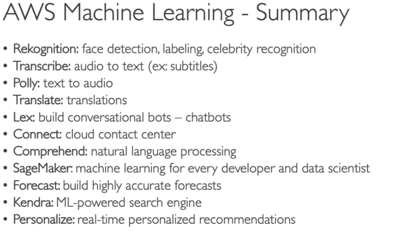

# AWS Cloud practitioner exam CLF-C01

[AWS-Cost-Calculator](https://calculator.aws/#/)

[Resources for AWS Certifications](https://aws.amazon.com/it/certification/certified-cloud-practitioner/?c=sec&sec=resources>)

[Free course with tests from aCloud.Guru](https://learn.acloud.guru/course/aws--certified-cloud-practitioner/overview)

---

**Cloud computing** is the **on-demand delivery** of computer power, database storage, applications and other IT
services that is delivered through a **cloud service** (i.e. AWS or GCP) with **pay-as-you-go** pricing (you pay when
you consume). Scaling (up or down) is also on-demand and almost instantaneous. The service provider takes care of
maintenance, you only use what you need!

We can have:

* Private Cloud like **rackspace** (out-of-scope)
* **Public Cloud** (AWS, GSP, AZ), which are 3rd parties cloud resources delivered over the internet
* **Hybrid Cloud**, where some servers are private and some capabilities are on public cloud; it gives the ability to
  control sensitive assets on private cloud and still leverage flexibility and effectiveness of public cloud services

The `five` **Keys** of Cloud computing are:

* **On-demand self-service** without human interaction with the provider
* **Broad network access** from anywhere
* **Multi-tenancy** : multiple customers can share the same infrastructure without renouncing to security and privacy
* **Elasticity and scalability** on-demand
* **Measured server**: you pay for what you use

The `Six` **Advantages** of Cloud computing are:

* **Trade capital expense (CAPEX) for operational expense (OPEX)**: pay on-demand not the hardware, reduce **TCO** (
  Total Cost of Ownership) and **OPEX** (Operational Expense)
* **Economy of scale**: price are reduced as the increase of efficiency
* **Stop Guessing capacity**: we will scale on actual usage metrics
* **Increase speed and agility**
* **No costs of maintenance**
* **Up and running in minutes**

# Types of Cloud Computing

* `IaaS` **Infrastructure as a Service**: first step in the transition from traditional IT service; provides networking,
  computers, data storage with a **high level of flexibility**
* `PaaS` **Platform as a Service**: no need to take care of the underlying infrastructure; focus on deployment and
  managing of your application
* `FaaS` **Function as a Service**: read serverless services like Lambda function
* `SaaS` **Software as a Service**: we only use the product that is run and managed from the provider (the lowest level
  of flexibility)

---

# AWS specific

[Compare AWS service instances for cost optimization](https://instances.vantage.sh/)

## How to access AWS

We have 3 ways to access AWS services:

* AWS Management Console, protected by password and MFA
* AWS CLI protected by access key (open source )
* AWS SDK - to embed services in our code, protected by access key

Access keys are generated from the AWS Console, one for each user (don't share between users). One the pair access ID
and Key has been generated we can log in into the CLI with the command `aws configure`.
Once the user has logged in it can perform from cli almost all the actions that are possible from the Console.

An alternative to the CLI is the `Cloud Shell` a service that is not available in all the regions but that essentially
mimic the cli in the browser.

## Pricing fundamentals

* **Compute**: you pay for computation time
* **Storage**: you pay for data stored
* **Networking**: you pay for transfer data **OUT** of the cloud (IN is free)

## Global Infrastructure

The infrastructure of AWS is divided in :

* **Regions**: are cluster of data centers and are named like us-east-1, eu-west-3; AWS services are **region scoped**
  meaning that if we use the same service on different regions it is like we are using it more than once... hence we pay
  more. `How to choose a region?` the factor to consider are:
    * **Compliance**: data might have legal requirement to resides in a particular region
    * **Proximity**: closer to the customer means less latency
    * **Available** services: not al services are available everywhere (Only the one tagged as **Global** as route 53)
    * **Pricing**: might vary from region to region
* **Availability Zones**: at least 2, max 6. usually 3, (e.g. eu-west-3a, eu-west-3b, eu-west-3c) are a group of one or
  more autonomous datacenter; they are isolated from disaster, hence if one fail the others should be available. They
  are connected with high bandwidth and low latency networking
* **Data Centers**
* **Edge Locations**

---

# Account Management

## AWS Organizations

Organizations is a global service that allows to manage multiple AWS accounts through the main account that is called
master account. There are cost benefits due to the aggregate billings, aggregate usage (the more the resources used the
more is the discount) and reserve instances are shared between account to optimize usage. There is an API available to
manage the Organization an automate the account creation. We cna also restrict the account privileges using a
**Service Control Policy SCP**. SCP must be explicit enabled, and it is used mainly to restrict access to certain
services or by disabling them. We can either use a blacklist or whitelist approach depending on if we want to explicit
the services that cannot or can be used.

We can have Multiple accounts strategies (e.g. one account per business unit) for better regulatory restriction SCP,
resource isolation VPC and isolated logging. We can use tagging for identify billings pertinence

### Consolidate Billing

Consolidating the billing over the organization provide us with only one bill and the benefit of combined usage (the
more resources we use the less we spend)

### AWS Control Tower

It is an easy way to set up and govern a secure multi-account AWS environment based on best practices without doing
things by hand. We can automate policy management, monitor policy violation anc compliance with an interactive
dashboard. Control Tower runs on top of AWS Organizations. It automatically implements the SCP.

# Billing & Supports

## Pricing Models

[Inspect the AWS free tier](https://aws.amazon.com/it/free/?all-free-tier.sort-by=item.additionalFields.SortRank&all-free-tier.sort-order=asc&awsf.Free%20Tier%20Types=tier%23always-free&awsf.Free%20Tier%20Categories=*all)

AWS stands on 4 pricing models:

* Pay as you go
* Save when you reserve (long terms requirement are cheaper)
* Pay less by using more (volume-based discount)
* Pay less as AWS grows (economy of scale)

### AWS Compute Optimizer

Reduce the cost and improve performances by analyzing your workload and suggesting optimal AWS resources

### Billing and Costing tools

We have several tools on AWS to estimate and tracking costs.

For estimating costs:

* price calculator

For tracking expenses

* billing dashboard
* cost allocation tags
* cost and usage reports
* cost explorer

For Monitoring:

* Billing alarms
* Budgets

### Aws Budget Setup

To access budget setup from a non-root user we need to explicitly enable IAM access (admin privilege are not sufficient)
. It is a good practice to create a **Budget** that will help us to keep tracking on how much we are spending over time
and when some personalized thresholds are reached

## Trusted Advisor

It is a high level AWS account assessment that provides recommendation on 5 categories:

* cost optimization
* performance
* security
* fault tolerance
* service limits

---

# AWS Architecting & Ecosystem

## General Guiding Principles for Architectural Framework

To build an efficient infrastructure on the cloud we should:

* stop guessing your capacity needs, use autoscaling!
* test system at production scale
* use IaaC and PaaS to build automated architecture that can be easily experimented
* allow for evolutionary architecture
* drive the architecture using data, don't guess your needs, look at your specific business requirements
* stress test your application

## Design Principles

The AWS cloud best practices are:

* scalability, both vertical and horizontal
* disposable resource: easy to configure
* automation: when possible, use serverless, IaaS, autoscaling etc.
* loose coupling: don't build monolith but smaller components loosely connected
* services not server: don't use only EC2 instances, leverage serverless and fully-managed services

## 6 pillar of well architected Framework

* **Operation Excellence** : the ability to run and monitor systems to deliver business value
    * Design Principles:
        * perform operation as a code (read IaaC - CloudFormation)
        * annotated documentation (automated after every build)
        * frequent, small, reversible change
        * refine operations procedures frequently
        * anticipate failure
        * learn from failure
* **Security** : protect information, system and assets while delivering business value
    * Design Principles
        * implement strong identity foundation - principle of the least privileges
        * Enable traceability integrating logs and metrics
        * Apply security layers such as VPC, subnets etc.
        * Encrypt data both at rest and in transit
        * keep people away from data, reduce the need of direct access to them
        * simulate incidents in order to be prepared
* **Reliability** : ability to recover from interruption/disaster, dynamically acquire computing resources on demand
    * Design Principles:
        * test recovery procedures
        * automatically recover from failure
        * scale horizontally to increase stability
        * stop guessing capacity, use autoscaling
        * Use IaaC or PaaS to automate changes from code
* **Performance Efficiency**
    * Design Principles: use computing resources efficiently, on-demand and over time
        * leverage advanced technology, focus on product development
        * Go global in minutes
        * Use serverless architectures
        * Experiment as often as you can
        * be aware of all AWS services, don't reinvent the wheel
* **Const Optimization**
    * Design Principles: deliver business value spending the least
        * try to embrace pay-per-use technologies
        * measure efficiency using CloudWatch
        * stop spending on datacenter
        * identify system usage (tags helps)
        * use serverless if possible, it is less costly not to manage the backend
* **Sustainability** (NEW)
    * Design Principles: minimize environmental impacts
        * understand your impact in terms of consumptions
        * goals should be sustainable
        * use managed service since they use shared infrastructures
        * reduce downstream impact (customers resources needed to run your application)

These are not requirements to balance, they should coexist in synergy.

### AWS Well-Architected Tool

It is a tool to review your architecture against the 6 pillars and adopt architectural best practices

### AWS Right Sizing

right sizing is the process of matching at best type and size of EC2 instances depending on your workload performance
and capacity requirements with the lowest cost possible. Scaling up is easy so start small!

## The AWS Ecosystem

A lot of free resources:

* AWS Blogs
* AWS re:Post (formerly AWS Forums)
* AWS Whitepaper
* AWS Quick Start (leverage CloudFormation)
* AWS Solutions
* AWS Knowledge Center (most frequent and common requests)

and paid tier for AWS support:

* developer
* business
* enterprise

### AWS Marketplace

Marketplace for 3rd parties software, templates etc.

### AWS Training

Online, classroom, on-demand

### AWS Professional Services & Partners

A team of experts for enterprise members; the APN -AWS Partner Network

## AWS IQ

The fastest way to find, engage and pay 3rd party experts on AWS on-demand

---

# Security and Compliance

The key of security and compliance on AWS ids the ` AWS Shared Responsibility Model`.

* AWS is responsible for security `OF` the cloud
* WE are responsible for security `IN` the cloud
* SHARED controls are patch and configuration management, **Awareness & Training**

## DDOS Distributed Denial-of-Service

It is an attack that aim to block our application servers by sending many fake request through bots, clogging the
network making it inaccessible to normal users. To protect from DDO we have:

* AWS Shield Standard
* AWS Shield Advanced
* AWS WAF
* CouldFront and Route 53

## Penetration Testing

We can test some of the AWS services (the most common) to penetration testing without asking for permission, but we
cannot simulate attacks such as DDOS or Request Flooding

## Encryption - AWS KMS (Key Management Service)

We can have encryption at rest (e.g. data on a db) or in transit (data in motion on the network). AWS KMS it the service
to handle encryption, and it will manage the encryption keys for us.

## AWS ACM - Certificate Manager

ACM is the service to provision, manage and deploy SSL/TLS Certificates to provide in-flight encryption for websites (
HTTPS)

## AWS Secrets Manager

It is a password manager; we can customize it to enforce password rotation and password generations leveraging lambda
functions, and can be integrated with RDS. Passwords are encrypted with KMS.

## AWS Artifact Report and Agreements

It is a portal that provide AWS compliance documentation and AWS agreements. We can download AWS certificates of
quality and security etc.

## Amazon GuardDuty

GuardDuty is an ML-powered service to protect our AWS account that is used for anomaly detection and 3rd party data.

## Amazon Inspector

Inspector automate security assessments on EC2 instances and containers pushed to ECR.

## AWS Config

Config is a security service that records the configurations and their changes over time. It can store data on S3, and
we can set up SNS notification service for any changes. It has to be set up for each region but data can be aggregated
across regions and accounts.

## Amazon Macie

Macie is a fully managed data security and privacy service that use ML to discover and protect sensitive data on AWS.

## AWS Security Hub

Security Hub is the tool to manage security across multiple AWS accounts and automate security checks. It has an
integrated dashboard that can aggregate issues and compliance from all the other security services such as GuardDuty,
Inspector, Macie etc.

## Amazon Detective

Detective analyze and investigates the root of security issues or suspicious activities using ML and graph to speed up
the process.

## AWS Abuse

It is the service used to notify AWS resources used for abusive or illegal purpose like spam, port scanning DDoS etc.

## Root User Privilege

Some actions are only devoted to root user (not even to admin user) and these are:

* change account setting
* tas invoice
* close the aws account
* restore IAM permission
* change AWS support plan
* Register a seller in the marketplace
* configure S3 to enable MFA
* edit or delete S3 bucket policy
* sign up to GovCloud

---

# Services with `Global Scope`

Services that have a global scopes are region-independent, meaning that they can be accessed from any region.

* IAM: Identity and Access Management
* Route 53
* CloudFront

## IAM - Identity and Access Management

It used to set up users and groups in the organization, and give them permissions, through a JSON file called IAM
policy, under the Root account. Groups can only contain users and not other groups, while a user can belong to more than
one group. The **least privilege principle** is applied: don't give a user more permissions than needed.
We can also have **inline policy** that are applied to single users that don't belong to a group.

As Said, the policy is a JSON document composed by:

* Version : "2012-10-17"
* Id (optional)
* Statement (required) one or multiple, composed of:
    * Sid - Statement Identifier (optional)
    * **Effect**: **Allow** or **Deny** access
    * **Principal**: account/user/role to which the policy is applied
    * **Action**: list of actions that can or cannot be done ("*" indicates all actions)
    * **Resources**: list of resources to which the policy is applied ("*" indicates all resources)

### Policy options for Groups and Users

* AdministrationAccess: the group has administrators policy on the account
* IAMReadOnlyAccess

### Password Policy

To control the security of our organization we can set Password policy like:

* minimum password length
* required specific characters
* allow/deny for password changes or set an expiration date or prevent password re-use

Use of **MFA** Multi-Factor Authentication is strongly recommended at least for Root User. The possible MFA devices are:

* Virtual MFA like Google authenticator (only phone) or Authy (multi-device)
* Universal 2nd Factor U2F Security Key which is a physical device, like an usb key that holds the authentication token
* Hardware Key Fob MFA Device which is a physical token generator

### Roles

Roles are specific permission that we give NOT to user but to services since they might need to perform actions on our
behalf. Common uses cases are permission role for EC2 instances and Lambda functions.

### Security Tools

IAM is shipped with security tools both at root and user level:

* **IAM Credentials Report** list all the users and the status of their credential
* **IAM Access Advisor** shows the permission granted to a user and when the permission where used; this can help to
  restrict unused permissions

## Advance Identity

### AWS STS (Security Token Service)

STS is the service to create temporary, limited privilege credentials to access AWS resources. examples are IAM roles
for account access or for EC2 instances access.

### Cognito

Cognito is an identity manager for web and mobile application users. Instead of creating IAM user we create users and
authentications with cognito.

### AWS Directory Services

Manage Microsoft AD

### AWS IAM Identity Center (formerly AWS Single Sign-On)

Gives us a single login point fot all our AWS accounts

---

# Regional Services

## Elastic Compute Cloud - EC2

EC2 is probably the most popular service on AWS and serves to perform `Infrastucture as a Service` design. Inside the
service we have many capabilities such as:

* Renting VM (**EC2**)
* Storing Data on virtual hard drives (**EBS**)
* Load balancer (**ELB**)
* Scaling services with auto-scaling groups (**ASG**)

## EC2 VM

When setting up an EC2 Vm we can:

* choose between linux, windows and macOS
* select the CPU
* select the RAM
* select the Storage
    * Network-attached (**EBS & EFS**)
    * Physically-attached (**EC2 Instance Store**)
* select network config
* select firewall rules (**Security group**)
* set Bootstrap script at first launch (**EC2 User Data**)

### EC2 Instance Type

We have many instance type for the VM that are continuous updated and upgraded; right now the lower free tier instance
it's the **t4.micro** up to the **m5.8xlarge**, depending on how much power we need and how much we want to spend (the
acronym usually indicates for which use case the type of vm is specialized, RAM optimize, Storage optimize etc.).
Connection to an EC2 instance require Key pairs for authentication such ar RSA.

### EC2 User Data

It is common to perform some actions at boostrap of our VM, such as download/install/update software/files. The script
runs with root privilege, hence with SUDO

### Security Group -SG

The EC2 instance will be wrapped around a Security Group (acting as a firewall) that will contain **allow rules**
for `Inbound` and `Outbound` traffic. By default, Outbound traffic is free from all IPs while Inbounds traffic is
blocked. Security rules will be composed of a:

* Type: the type odf connection (http, ssh etc.)
* Protocol (TCP etc.)
* Port Range
* Source (allowed IPs, 0.0.0.0/0 means everything)

SG are not bounded to a single EC2 instance but are locked to a **region/VPC** combination. An instance can
have multiple SG that still lives outside it (if something get blocked the instance won't even see it). An SG can also
reference other SG, for example to allow connection from multiple EC2 instances that owns their SG

It is good practice to create a security group devoted to ssh access. From the folder where we have saved our .pem file:

* `ssh -i nomeFile.pem ec2-user@publicIpOfEC2Instance`

#### Ports to remember

* 22 : ssh, to log in a linux instance
* 21 : ftp (file transfer protocol), to upload files into a file share
* 22 : sftp (secure file transfer protocol), upload files with ssh
* 80 : http
* 443 : https
* 3389 : rdp (remote desktop protocol) for log into windows instance

### Roles

We can attach specific roles to our EC2 instances from Actions->Security->Modify IAM role. For example, attaching the
IAMReadOnly policy we will be able to use aws cli from ssh without authentication of a specific user to perform reading
operation

### Purchasing options

Depending on the usage we have different type of purchasing options for the EC2 services:

* On-demand: for short workload, pay by second
* Reserved: 1 or 3 yrs for long workload (up to 72% discount)
* Saving Plans: 1 or 3 yrs for a specific amount of usage (up to 72% discount)
* Spot Instances: for short workload, cheap but unreliable (up to 90% discount)
* Dedicated Host: an entire physical server is reserved, we have access to its lower level (most expensive)
* Dedicated Instance: no other customer shar our hardware
* Capacity Reservation: reserve a capacity for any duration (no discount)

### Shared Responsibility

We are responsible for:

* security groups rules
* OS updates and all software installed
* IAM roles
* Data security on the instance

## EC2 Storage

We have different type of storage that can be attached to our VM.

### EBS Volume - Elastic Block Store

It is a network drive (like a USB stick but not physical) that can be attached to VM to persist data even after
termination (**N.B. the delete-on-termination flag is turned on by default for the root volume of the EC2 instance while
not for EBS volume, but we can change it**). It can be mounted to only one instance at the time (at Cloud practitioner
level), and it is bounded to an availability zone; however we can create a **snapshot** of the volume and transfer it to
another AZ (to create a snapshot is best practise to detach the volume from the instance first). We need to define in
advance its capacity in terms of Size and **IOPS** (I/O operations per second). A VM can have multiple EBS volume
attached to it, and an EBS can also live if not attached to any VM.

#### Snapshots

There are two places is possible to store EBS snapshots:

* Snapshot Archive: which is an archive tier that is cheaper but slower to restoring (24-72 hours)
* Recycle Bin: we can specify a retention policy (1 day to 1 yr) to recover accidental deletions

### AMI - Amazon Machine Image

It is a customization of an EC2 instance, by which we pre-package software, configurations, OS, to have a faster boot
time. AMI can be public (provided by Amazon), custom-made or purchased on the AMI marketplace; are built for specific
region but can be easily moved across regions. We can create our own AMI from an active EC2 instance (maybe because we
want to replicate part of the bootstrap process we have already performed into another instance) by simply creating an
image of the EC2 instance (right-click create image). Once we have an AMI, we can use it during the creation of a new
EC2 instance as base image.

#### Image Builder

Image builder is a free tool to automate the creation of Vm and container images. It creates an EC2 builder instance
that performs a series of predefined task (e.g. software installation, configuration etc.) then it creates an AMI from
it, then it test it, and finally it distributes it.

### EC2 Instance Store

EBS volume, being network drive, have limited performance due to latency; if e need a high-performance hd (better I/=
performance) we have the Instance Store which has the drawback of being ephemeral, meaning that the storage is lost once
the EC2 instance is stopped (not good for long-term storage)

### EFS Elastic File System

Contrary to the EBS that can be attached to a single EC2 instance, an EFS is a network file system, meaning that it can
be attached to hundreds of EC2 instances at the same time also across multiple AZ (which makes is pretty expensive even
if it is pay-per-use)

#### EFS Infrequent Access

To optimize the cost of EFS we have the possibility to move (automatically) files that are not frequently use to a
secondary EFS which is much cheaper. We can define a lifecycle policy that will automatically determine when to move a
file from the standard EFS to the Infrequent Access and vice-versa.

### Amazon FSx

Is the service that allows to launch 3rd party high-performance file system (e.g. a corporate data center) on AWS. In
particular, we have:

* FSx for Windows Servers
* FSx for Luster (Linux Cluster)

### Shared Responsibility

We are responsible for:

* backup and snapshots
* data encryption
* risk related to instance store (if the EC2 instance fail we lose the data).

## Scalability - ELB & ASG

Definitions:

* `Scalability`: an application can handle greater loads by adapting
    * **Vertical Scalability** : we can increase the size of the instance (e.g. from a lower to a bigger EC2 instance,
      increasing the size of a db). It has usually an upper limit due to hardware constraint
    * **Horizontal Scalability** == `Elasticity` : we can increase the number of instances of our application; it
      implies we have a distributed system, like a web application that will easily scale up on AWS with ELB and ASG (
      usually pay-per-use and match on demand needs in order to optimize costs)
* `Availability`: running the application in more than one AZ to prevent failures and downtime
* `Agility`: is a distractor and not related to scalability; it means having an IT resource ready available for our
  developers

### ELB - Elastic Load Balancer

A Load Balancer is a server that work as a filter to the traffic directed to our application. It redirects the requests
to multiple EC2 instances downstream in order to distribute the loads. The application has always one single point of
access (DNS) but the traffic is redirected to several replicas of our backend). ELB in a managed load balancer, meaning
that it is handled by AWS in terms of maintenance, availability and upgrade. we can configure our own load balancer (
cheaper) but it requires a lot more effort. We can have 2 type of load balancer on AWS:

* **Application Load Balancer - ABL** for http/https only - Layer 7
* **Network Load Balancer** for ultra-high performance, allows TCP - Layer 4

### ASG - Auto Scaling Group

The load on our application is not usually constant in time, not even in the same day, therefore we need a way to adjust
the scalability of our application. The role of an ASG is exact to scale out (add EC2 VM) or scale in (remove EC2 VM) to
match and increase/decrease of load on our application; it also ensures to have a minimum/maximum number of EC2
instances, to register new instances to the load balancer and to replace unhealthy instances. In this way we are
optimizing the costs since we are using only the resources we need.

#### Scaling Strategy

We have different typeof scaling strategy depending on our needs:

* **Manual Scaling**
* **Dynamic Scaling**
    * **Simple / Step Scaling** : when CloudWatch alarm is triggered add 2 units or remove 1 (CPU usage greater than 70%
      or lower than 30%)
    * **Target Tracking Scale** : we want an average CPU usage
    * **Schedule Scaling** : we have a known pattern for our application, therefore we increase capacity for particular
      period of the day/week/month/year
* **Predictive Scaling**: use ML to predict future traffic (when loads have a predictable pattern)

## S3 - "infinitely scaling" Storage

S3 is the storage service for AWS; it is used by many websites as backbone and by many AWS services as well. Among its
applications, the most common are:

* Backup and storage
* Disaster Recovery
* Archive
* Hybrid CLoud Storage (expanding corporate storage)
* Application hosting
* Media hosting
* Data lakes & big data analytics
* Deliver Software updates
* Static Websites Hosting (the bucket policy must allow public reads)

The S3 directories are called `Buckets` which are objects that must have a globally unique name across all AWS. Buckets
are defined at region level. Files are stored and retrieve from buckets by their **key** which is composed by a **
prefix** (the path to the file) **plus the object name**. Keys might be very long name that looks like directories path,
but they are not. The max. object size is 5TB and if a file is bigger than 5GB it must be uploaded in parts. An object
can hold metadata, tags or version ID (if versioning is enabled)

### Security

S3 security can be set at different levels:

* User-Based: IAM policy specify which API calls should be allowed for a specific IAM users
* Resource-Based:
    * **Bucket Policies**: json-based rules that are bucket-specific that are set from S3 console (can allow
      cross-account
      access). they specify which kind of permission is denied/allowed and to which users it applies
* Encryption: objects on S3 can be encrypted with encryption keys

To sum up:

* if **web visitor** want to access our S3 bucket we will need a **bucket policy** that allows public access
* if an **IAM user from another account** want to access our S3 bucket we will need a **bucket policy** that allows
  cross-account access
* if an **IAM user** what to access the bucket it will need a specific **IAM policy**
* if an **AWS service** (like an EC2) want to access the bucket it will need an **Instance Role** (IAM permission)

By default, AWS has placed an extra security layer "Block public access" that need to be explicitly disabled in order
for the policies/roles to take action.

### Versioning files

It is possible to enable versioning at bucket level, this will create a key that holds a version number for each object,
so that our files are protected from unintended deletes. Object that are already present prior to versioning activation
will have a version of null while disabling versioning will keep the versioned objects (safe operation)

### Replication

We have two different replication mechanism:

* CRR: Cross-Region Replication (use case: lower latency and replication across accounts)
* SRR: Same Region Replication (use case: live replication between production and test environment)

Replication will be asynchronous between buckets that needs to have versioning enabled and can be owned by different AWS
account. Under management settings of the S3 bucket we can create a replication rule, enabling replication to a bucket
in the same account or in another account. Moreover, we need to create a specific IAM Role.

### Storage Classes

We have different class of S3 Storage:

* **S3 Standard** - general purpose, used for frequently accessed data, low latency (use case: big data analytics,
  mobile & game applications)
* **S3 Standard-Infrequent Access** (IA), for data less frequently access but that requires rapid access; we pay for
  retrieval but on average it has lower cost than S3 standard (use case: disaster recovery, backups)
* **S3 One Zone-Infrequent Access**, lives in only one AZ so if that it lost that are lost as well, it has high
  durability but lower availability (use case: secondary backup copies)
* **S3 Glacier**, low-cost object storage meant for archive/backup; we pay for storage and retrieval
    * **Instant Retrieval**: milliseconds retrieval, min storage duration 90 days
    * **Flexible Retrieval**: different retrieval time depending on cost (Expedited 1-5 min) (Standard 2-5 hours) (5-12
      hours for free), min storage duration 90 days
    * **Deep Archive**: for long term storage, min storage duration 180 days; retrieval is slow, Standard 12 hours, Bulk
      48 hours
* **S3 Intelligent Tiering**: we pay for monitoring and auto-tiering, meaning that AWS will automatically determine
  where to
  place our data based on their accessibility request

We can move between classes manually or using S3 Lifecycle configurations where we manually set the period of time ofter
which a file must be moved from one class to the other.

We have two measure for Storage Classes:

* `Durability`: the possibility that objects in the S3 might be lost; it is extremely low, and it is the same for all
  storage classes
* `Availability`: measure the availability of S3; on average it is 53 minutes a year of unavailability, but varies among
  classes

### Encryption

We have 3 type of possible encryption for our file on S3 buckets:

* No Encryption
* **Server-Side Encryption**: the file is encrypted by AWS once arrives in the bucket
* **Client-Side Encryption**: the file is encrypted by the client prior to sending it to the bucket

### AWS Snow Family

Snow family are highly-secure, portable device to collect and process data at the edge and migrate data into and out
AWS.

In particular, we have:

* **Data migration**, for uploads that might take more than a week. Basically AWS sends us home a storage device by
  post, we
  upload to it physically and sent it back. Then AWS will upload our file into the server for us
    * **Snowcone** (8TB, much smaller and portable than Edge, used for edge computing and storage even in harsh
      environment
      conditions; it needs battery or a power source and can send back to AWS offline ot connect to internet through AWS
      DataSync)
    * **Snowball** Edge (80TB or 42TB)
    * **Snowmobile** (it is an actual truck with 100 PB and can migrate up to 1 Exabyte (1M of Tera), high security,
      temperature controlled, GPS, 24/7 surveillance)
* **Edge Computing** (an Edge location is a place where data can be produced but there is no or limited connectivity)
    * **Snowcone** (2 Cpu, 4Gn ram, usb c port and optional batteries)
    * **Snowball** Edge (52 cpu, 208 gb ram, 42 tb) or (40 cpu, 80 gb ram 80tb)

All the devices can run Ec2 Instances and Lambda functions using AWS IoT Greengrass.

AWS OpsHub is a GUI that can be installed on our laptop to manage the snow devices

### AWS Storage Gateway

The Storage gateway is a mean to create hybrid clod solution; it allows to bridge corporate storage with AWS cloud, for
example for disaster recovery, backup etc.

### Shared Responsibility

We are responsible for:

* Versioning
* Bucket policies
* Replication Setup
* Logging Monitoring
* Storage Classes
* Data encryption at rest and transit

## Databases

We have essentially 2 type of databases:

* **SQL** for relational database (excel-like tables)
* **NoSQL** for non-relational database, build for specific data models and with flexible schemas; this allows
  flexibility in the evolution of data model, scalability, high-performance optimized for specific data model. JSON is
  the most common example of NoSQL representation

AWS offers a set of managed databases, meaning that AWS will take care provisioning, scaling (vertical and horizontal),
backup, restore and upgrade, monitoring and alerting. We can run our own db technology on EC2 instances, but we need to
take care of all the things just listed on our own.

### AWS RDS - Relational Database Service

RDS is a managed cloud db, that can host many types of db technologies like postgres, mariadb, mysql and Aurora (an AWS
proprietary technology). AWS will manage all the operation to keep the db healthy and the only down part is that we
CANNOT access the db with ssh to inspect it.

#### Deployment - Read Replicas and Multi AZ

We have two types of deployment for our db:

* Read Replicas: to scale the read workload of our db we can create up to 5 replicas of our main db only for reading;
  data will be written only to the main db
* Multi-AZ: we have a failover strategy, i.e. a replica of our db on another AZ that will be called only in case of
  problems with the main db
* Multi-Region: we can have replicas of our db also in other regions only for reading data, data will be written only to
  the main db. This can be done for disaster recovery but also for having better local performance if our application
  works on multiple regions. It is more expensive because we need to take into account replication (and therefore
  transfer) of data between multiple regions

#### Aurora

Aurora is an AWS proprietary db technology that supports postgres and mysql; it is cloud optimize therefore it will be
much faster that the same db directly hosted on rds. It has an automatic storage increase at a step of 10GB, but it is
20% more expensive than standard RDS (not in free tier)

### ElastiCache

Same as RDS handle SQL database, ElastiCache manage Redis or Memcached, i.e. in **memory database** with low latency and
high performance. It is usually use to alleviate pressure on highly trafficked db, storing in cache the queries and the
data associated for fast read/write operations

### DynamoDB

Dynamo is a fully managed, highly available (replication across 3 AZ) NoSQL db. It is a `serverless` db, meaning that
the user don't see and don't manage the servers in the backend. It cna scale massively with millions of request per
seconds and trillions of rows, up to 100TB of storage. It has a single-digit millisecond latency and consistent
performance. It is integrated with IAM security. It has low cost and auto-scaling capabilities.

Data are stored with key/values, where keys are composed by a **partition key** and a **sort key**, and the values is
the actual schema for the particular item.

#### DAX - DynamoDB Accelerator

DAX is a fully-managed in-memory cache (like ElastiCache but ONLY for dynamoDB) which is used to store table with the
most frequent access to have an even better performance (up to 10x performance improvement)

#### Global Tables

Global tables have the characteristic of being low latency and available in multiple regions

### RedShift

Redshift is a postgres-based db but not used for OLTP (Online Transaction Properties, what RDS is good for) but for
**OLAP** (Online Analytical Processing) which is required for **data analytics and data warehousing**. We don't load
data continuously, but e.g. every hour and have a10x better performance than other data warehouse and can scale to PB of
data. Data are stored in columns (**Columnar** storage) and use MPP (**Massive Parallel Query Execution**) to boost
query performance. Has a SQL interface for queries and can be integrated with BI Tools such as AWS Quicksight ot
Tableau.

### EMR - Elastic MapReduce

It is not strictly a db but a **Hadoop cluster** for analyze and process Big Data. We can create a cluster of hundreds
of EC2 instances to analyze bi data. It supports bid data technologies such as apache spark, HBase etc. EMR takes care
of the configurations of the cluster, it has autoscaling. Its main use case is data processing, ML, web indexing etc.

### Athena

Athena is a `serveless` service to perform query (use SQL language) and analytics on S3 objects. Its use case is for BI,
analytics, reporting etc. It can be integrated with AWS QuickSight for dashboard and reporting.

### Amazon QuickSight

Amazon QuickSight is a `serverless` ML-powered BI service to create interactive dashboard. It is fast, scalable and can
be integrated with RDS, Athena, RedShift, S3 etc. Its use case is for business analytics, visualizations BI etc.

### DocumentDB

DocumentDB is the AWS implementation of MongoDB NoSQL db (Like Aurora for postgres/mysql). It has high performance,
fully managed, replication up to 3 AZ.

### Amazon Neptune

Neptune is a fully managed **graph db** (an example of graph dataset is a social network connections). It is optimized
for highly connected dataset, can store billions of relations with very low latency queries, high replication (up to 15
replicas). Its use case is for knowledge graph(wikipedia) fraud detection, recommendation engine, social network

### Amazon QLDB - Quantum Ledger DataBase

QLDB is a fully managed, `serverless`, highly available service.

A ledger is a book to record financial transaction; as such, QLDB is used to review all the history of changes to our
application data over time. it is an immutable system, meaning that an entry can't be modified/deleted. Data can be
manipulated wih SWL language. The difference with Amazon Managed Blockchain is that here we have a central authority (
Amazon) and no concept of decentralization.

### Amazon Managed Blockchain

It is used to build decentralized applications; it is a managed service to join existing blockchain or create private
network. It is compatible with Ethereum and Hyperledger Fabric.

### AWS GLUE ETL

Glue is a `serverless` service to extract, transform and load data (**ETL**). it is used to prepare and transform data
for analytics

### DMS - Database Migration Service

DMS is a service to migrate databases to AWS while the source db remains available during migration. We can have
Homogeneous or Heterogeneous migration depending on if the source and the target have the same db technology

## Containers on AWS

### ECS - Elastic Container Service

ECS is the service that is used to launch Docker container on AWS. We must provision and maintain the EC2 instance that
will hold the container in advance while AWS will take care of starting/stopping the containers and can be integrated
with an application load balancer. The ECS will be smart enough to understand where to place the container in our EC2
cluster

### Fargate

like ECS, it is used to launch docker containers on AWS but without the need of handling EC2 instances. It is
a `serverless` service.

### ECR - Elastic Container Registry

Is the equivalent of docker hub for AWS where we can privately store our docker images

## Serverless services

Serverless is paradigm in which the developer don't have to manage servers (these are managed directly by the cloud
provider in the backend) and just deploy code. It is the means by which we create FaaS infrastructure (Function as a
Service).

Among the most used AWS serverless service we have:

* S3 for storage
* DynamoDB for NoSQL
* Fargate for docker containers
* Lambda Functions

### Lambda Function

Lambda Function are Virtual functions that are meant to be limited in time (short execution) and run on-demand with
automatic scaling capabilities. We pay per request and compute time (and the free tier is quite generous), it is
integrated with the whole AWS ecosystem and are design to be event-driven, i.e. the function is invoked only when
needed. They can be easily monitored with AWS CloudWatch and can scale up to 10GB of RAM (improving also CPU and network
at the same time). Lambda supports many programming language and thanks to **Lambda Container Image** we can run
containers on top of lambda function (given that the container image implement Lambda API runtime).

**We pay for calls and duration of the call**. For the free tier we have 1M of request and 400k Gb-seconds (400k seconds
for a function with 1GB of RAM) of compute time a month)

#### Use case - CRON job

A common use case with lambdas is to automate periodic task. we can set up **CloudWatch Events EventBridge** to trigger
a specific script on a lambda every x time.

### API Gateway

The API Gateway is the service that allow us to expose our lambda function to outside AWS; the most common use case is
to build serverless REST API. It supports REST API ans WebSocket API, together with security, authentication, monitoring
etc.

### AWS Batch

Batch are processes tha have a start and an end (opposed to streaming processes). AWS Batch is a service to schedule
batch jobs and dynamically scale EC2 instances providing the right amount of cpu and memory required; we only need to
schedule the batch job, AWS do the rest. batch Jobs are essentially Docker Images that run on EC2.

Contrary to Lambdas, Batch have no time limit, can run any runtime if packed in a docker image, have no storage problem
since rely on the storage of the underling EC2 instance (EBS or instance store) but are NOT serverless even if the EC2
instances underlying are fully managed by AWS

### Amazon LightSail

It is the simplest cloud solution to manage VM, storage, db and networking with low and predictable perice. For people
with little cloud experience that want to deploy simple web application, simple easy website. It has high availability
but not autoscaling and limited AWS integration with other services

---

# Deployment & Managing Infrastructure at Scale

## CloudFormation - Infrastructure as a Code

CloudFormation is the service that allow us to build **IaaC** (**Infrastructure as a Code**, we use code to create the
infrastructure); we simply declare the resources that we need and the configurations and cloudformation will create them
in the right order. We don't create resources manually, and we can easily change/update the infrastructure through code,
having thou an excellent control over the application. It has also cost benefits since we can identify exactly in the
stack of resources how much they are costing; with the cloudformation templates we can have a good estimate of costs in
advance and in development stage we can set up automatic deletion and recreation of resources at some point of the day
therefore without waisting unused uptime (e.g. delete at 6 p.m and recreate at 8 a.m.). Also in productivity, we can
re-create infrastructure on the fly, generates template diagram automatically and forget about ordering and
orchestration since AWS will do this for us. Cloudformation support almost all the AWS resources.

### CDK - Cloud Development Kit

The CDK is the way to do Infrastructure as a code without using directly cloudformation but with our own programming
language of preference. the code is then compiled into a CloudFormation template. Very useful for lambda functions and
docker containers in ECS.

## AWS Elastic Beanstalk - Run and Manage Web App - Platform as a Service

A typical architecture for a web app is called `Web App 3-tier` in which we have an ELB in front of some EC2 instances
connected to an RDS db and potentially to and ElastiCache. Being a common infrastructure AWS thought of a way to
automate
its creation for the developer, alleviating the burden of setting up all the resources, the load balancer, the
autoscaling group and so on. Developer only want to run their code and possibly to have the same behavior independently
of the environment of deployment.

**Beanstalk** is and example of **PaaS** **Platform as a Service** where all the component of AWS are present in one
place to ease the process of deployment on AWS having full control over the configuration. As a service, beanstalk is
free, we are only going to pay for the underlying infrastructure that we are requesting. It is a fully managed service,
therefore we are only responsible for the code of the application. it has a Health monitoring instance on each resource
it creates that is pushed to CloudWatch. Beanstalk leverage CloudFormation for creating the resources.

**N.B. Beanstalk is application focused while CouldFormation is infrastructure focused**

## Software Development/Deployment

### CodeDeploy

It is a Hybrid service since it works bot with AWS and on-premises resources, and it serves the purpose to deploy our
application automatically or upgrading our existing resources. Servers or EC2 Instances must be provided in advance and
configured with the CodeDeploy Agent before performing the upgrade.

### CodeCommit

It is the AWS code Version Control Repository

### Code Build

It compiles code, run test and produce packages ready to be deployed, for example on CodeDeploy. It is fully managed
ans `serverless`.

### CodePipeline

CodePipeline is an orchestrator that allows to create pipelines that connect for example CodeCommit, CodeBuild and
CodeDeploy. It is a **CI/CD** tool (Continuous Integration & Continuous Delivery).

### CodeArtifact

It is an artifact manager software for development that stores software packages dependencies (artifact)

### CodeStart

It is a Unified User Interface to interact with all te service above in one place and easily manage software development
activities.

### Cloud9

It is the AWS IDE for coding directly on cloud. It allows also real-time pair programming

## SSM - System Manager

SSM is a Hybrid service since it works both with AWS and on-premises resources. It basically gives us insight about the
state of our infrastructure, performs patching and run commands across the entire cluster of servers. Support both Linux
and Windows servers.

### SSM - Session Manager

It allows to start secure shell on Ec2 Instances without the need of ssh access and no port 22.

### AWS OpsWorks (Chef and Puppet)

It is an alternative to SSM, and it is the AWS managed version of two server configuration software : **chef and
puppet**. It worked only with standard AWS resources such as EC2, RDS, ALB, EBS volume etc.

---

# Global Application

A global application is an application deployed in multiple regions to:

* decrease latency in the region of use
* disaster recovery
* attack protection

AWS has many services that are meant to facilitate an application to become global.

## Route 53

Route 53 is a **Managed DNS** (Domain Name System). In short, we can use it to create a DNS name for our application
server; the browser will interact with this DNS talking to Route 53 which will reply with the real IpV4 of the
application server; then the browser will be able to perform its http request directly to the application server. We can
also have a weighted routing policy which will redirect the traffic rom the browser based on the percentage of weight we
give to the instances connected by the same DNS. Latency Routing Policy instead will redirect the traffic based on the
user location to the closes regions. Failover routing Policy will have a failover instance to fallback in case the
primary is found to be unhealthy.

## CloudFront - CDN Content Delivery Network

CloudFront is a CDN that cache content at edge location to improve user experience reducing latency. There are
approximately 216 Edge Location in the world. It also provides DDoS protections and firewall trough **WAF - Web
Application Firewall**. We have an Origin location for our resources, called **OAC Origin Access Control**, the edge
location upon user request will look if it has the request already cached, if not will query the origin location, cache
the response and return it to the user. Very powerful for static content that must be available everywhere.

## S3 Transfer Accelerator

<https://s3-accelerate-speedtest.s3-accelerate.amazonaws.com/en/accelerate-speed-comparsion.html>

S3 instances are usually only available in the same Region, but if we want it to be available in other part of the world
we can leverage transfer accelerator: the bucket is transferred to the closest edge location and then send via a private
AWS very fast network to the destination required.

## Global accelerator

<https://speedtest.globalaccelerator.aws/#/>

The global accelerator is used to improve the global availability of an application leveraging the AWS global network
with increase in performance up to 60%. While CloudFront is made to deliver content and improves performance by caching
at edge location, Global accelerator doesn't perform any cache and direct traffic directly on to the AWS regions where
the application is running.

## AWS Outpost

AWS outpost are physical servers rack that offers the same infrastructure for Corporate usage like if it was performed
in the cloud. We will also have very low latency between corporate infrastructure and the outpost since they will
ideally be placed in the same physical place.

## AWS WaveLength

it is a bridge at 5G networks edge that serve to deploy ultra low latency application on the 5G network. Useful for
everything that need ultra low latency such as Smart cities, ML diagnostic, Real-Time Gaming etc.

## AWS Local Zone

Local Zone are basically extension to the VPC of our region of deployment that are used to bring the application closer
to the user and reduce the latency.

---

# Cloud Integration - Communication in the cloud

At some point, we will need our applications to communicate; there are mainly two patterns of communication:

* Synchronous: application to application
* Asynchronous or Event Based: application to queue to application

However, synchronous communication can be problematic if the traffic is not constant, and we have spikes that might
overwhelm our applications bottleneck. The advantage of asynchronous communication is that the two (or more) application
that are communicating are decoupled. Example of async communication in AWS are: SQS (queue model), SNS (pub/sub model)
, Kinesis (real-time data streaming model) and these services can scale independently of the application.

## SQS - Simple Queue Service

SQS is one of the oldest service on AWS, it if fully managed,  `serverless` and its aim id to **decouple** applications.
I can scale up to 10k message per seconds with a default retention of messaged from 4 to 14 days and low latency. It can
easily scale horizontally increasing the number of consumers and producers.

The concept is to have 2 roles, producers, i.e. the application that produce messages and send them into the queue, and
consumers, which read message from the queue. once a message is correctly read it is deleted from the queue

## Kinesis

Kinesis is the service devoted to **real-time big data streaming**, i.e. is a managed service to collect, process, and
analyze real-time streaming data at scale; we have different flavor of the service depending on the application (oof for
the exam):

* Kinesis Data Streams: ingest big data from many sources
* Kinesis Data Firehose: load to S3, ElasticSearch etc...
* Kinesis Data Analytics: real time analytics using SQL
* Kinesis Video Streams: ML on real-time videos

## SNS - Simple Notification Service

Contrary to SQS, we have a single event publisher that send messages to one SNS topic and as many event subscribers that
listen to the SNS notification, i.e. each subscriber will receive all the messages (while in SQS the consumers consumes
different messages). We can have up to 12.5 million of subscription for one topic, but only 100k topic at the same time.

## Amazon MQ

While SQS and SNS are cloud native application and proprietary protocols of AWS, traditional corporate application may
require open protocols. Therefore, in order to not re-engineer completely on-premises application to talk directly to
cloud native services, AWS provides Amazon MQ which is a **massage broker** for on-premises services like RabbitMQ and
ActiveMQ. MQ doesn't scale as much as SQS and SNS but implements bot queue and topic features.

---

# Cloud Monitoring

## CloudWatch

CloudWatch provides metrics for every service in AWS and can display the in custom dashboards. Common example of
dashboard metrics are:

* Billing Metrics (works only in us-east-1)
* EC2: CPU utilization, Network traffic (not RAM usage), by default metrics come every 5 min, but we can pay to have
  them
  down to each minute
* EBS: disk read/writes
* S3: bucket size, num of objects, requests made etc..
* Service limit: how much we are using an API

### CloudWatch Alarms

CloudWatch Alarms are used to trigger a notification when a specific metric reach a threshold or something is not going
as planned. Examples are:

* Auto Scaling action
* SNS notification
* Billing notification

We can have 3 states:

* OK
* INSUFFICIENT_DATA
* ALARM

### CloudWatch Logs

CloudWatch Logs enable real-time monitoring of logs from many AWS services such as Beanstalk, ECS, AWS Lambda, Rout53
etc. On EC2 instances we have to run a CloudWatch agent on the instance to push the logs file we want (we need also to
give IAM permission to send data to CloudWatch Logs).

## Service Health Dashboard

<https://health.aws.amazon.com/health/status>

It is a website that shows the health status of all the AWS services in all regions.

### Personal Health Dashboard

It is a customized health dashboard that provides alert and guidance when AWS is experiences issues that impact the
service your application are using.

## Amazon EventBridge (formerly CloudWatch Events)

With EventBridge we can create integration to our services, like scheduling the triggering of a lambda function (CRON
schedule), create event pattern (e.g. receive notification when someone logs as root), send SQS/SNS messages etc. We can
also react to event coming from outside AWS.

## CloudTrail

CloudTrail provides governance, compliance and audit for the AWS account. It is enabled by default and record any action
that happen on the account. We can apply it to a single region or to all region (default)

## X-Ray

X-Ray is the service that allows debugging on distributed services, which would be hard to perform since many actors are
at play. Once enabled, we will get a full picture of each services in the application, their performance and if they are
failing. We cna inspect dependencies in microservices, review request behavior, find errors and exceptions, if we are
meeting our SLA (Service Level Agreement). In short, we are doing distributed tracing of our application on the cloud.

## CodeGuru

CodeGuru is an ML-powered service to automate code review (static code analysis) and application performance (profiler
in production).

---

# VPC & Networking

**VPC** stands for **Virtual Private Cloud**, and it is a private network to deploy our resources; it is linked to a
specific region, hence if we work on multiple regions we need multiple VPC.

**Subnets** are part of the VPC and allows us to partition the network inside the VPC itself; subnets are linked to a
specific AZ. A subnet can be public, meaning that can be accessed from the internet outside AWS. to define access to
subnets we need to define **Route Tables**. In a private subnets we may place a db, since it is more secure, while in a
public one we can place the load balancer and the EC2 instances so that we can access them also from outside AWS.

An **Internet Gateway** is a tool that help the VPC instance (public subnets) to connect with the internet routing the
traffic.

**NAT Gateways** (AWS managed) and **NAT Instances** (self-managed) allow our instances in the private subnets to access
the internet while remaining private

## NACL - Network ACL & Security Groups

The NACL is a firewall at subnets level that can have ALLOW and DENY rules only on IP addresses while Security Groups
are firewall at instance level tha can only have ALLOW rules on IP addresses and other security groups.

## VPC Flow Logs

Flow logs is the way to capture logs about Ip traffic from/to VPC, Subnets and ENI (Elastic Network Interface) and also
AWS managed interfaces like load balancer RDS etc. VPC logs can be sent to S3 or to CloudWatch Logs

## VPC Peering

VPC Peering is the way to connect two VPC privately using the AWS network make them behaving like they were on the same
network. Must be enabled on any VPC we want to communicate.

## VPC Endpoints

Endpoints are the way to connect to our AWS services using a private network instead of the public internet. We can
have:

* VPC Endpoint **Gateway**: to connect to S3 and DynamoDB
* VPC Endpoint **Interface**: to connect to the rest of AWS services

## AWS PrivateLink

If we want to expose a services to multiple VPC (up to a 1k) we cannot use vpc peering since it doesn't scale; instead
we have privateLink. It requires a Network load balancer and ENI.

## Site to Site VPN & Direct Connect (DX)

If we want to connect corporate resources to its VPCs and AWS services we have two ways:

* using a site to site private vpn that goes on the internet, and it is encrypted (cheap)
* having a Direct Connect DX, i.e. a physical private connection to AWS servers, more secure and faster but also very
  expensive since we need to connect actual cables.

## AWS Client VPN

It is a VPN to connect using OpenVPN to your private network in AWS and on-premises resources. We can connect to an EC2
instance privately like if we were in the private VPC network.

## Transit Gateway

The transit gateway is a way to ease the network topology with a central transitive hub to which every VPC and VPN are
connected. We have one single gateway.

---

# Machine Learning

## Amazon Rekognition

Service for object, people, text images and video finders using ML as well as face rekognition

## Amazon Transcribe

Service to convert speech into text with multiple language supports, and we can also remove personal information using
Redaction

## Amazon Polly

Service to traduce text into speech

## Amazon Translate

It is the Google translator of AWS

## Amazon Lex + Connect

Power Alexa, it provides automatic speech recognition and NLP. Useful to build chatbot anc call center bots

## Amazon Comprehend

Service for NLP, serverless, use ML to find insight in text

## Amazon SageMaker

Fully managed service for Data scientist and developers to build ML models

## Amazon Forecast

Service deliver forecast

## Amazon Kendra

It is a fully managed document search service used to build a knowledge index of document

## Amazon Personalize

Fully managed service tu build apps with real-time personalized recommendation

## Amazon Textract

Extract data from text and handwriting on scanned data or photos (e.g. personal id scan)

---

# Other Services (Rarely appeared in the exam)

## Amazon Workspace

manage Desktop as a Service (DaaS) to provide desktop solution for windows and linux on the cloud

## Amazon AppStream 2.0

It is an application Desktop Streaming Service to deliver and application on the web browser

## Amazon Sumerian

Create VR and AR (augmented reality) and 3D applications

## Amazon IoT Core

Used to connect IoT devices into AWS Cloud

## Amazon Elastic Transcoder

Used to convert media files stored in S3 in a format required by the consumer (phones, TV, etc.)

## AWS AppSync

Make use of Graph QL to store and sync data across mobile phones and web apps in real-time

## AWS Amplify

A set of tools and services that helps us to develop and deploy full stack web and mobile applications

## Amazon Device Farm

Fully-managed service to test web and mobile apps against any type of device (desktop, phones, tablet etc.) even
concurrently

## AWS Backup

Fully-managed service to centrally manage and automate backups across AWS services. Supports cross-region and
cross-accounts backup.

### Disaster Recovery Strategy

We have four strategy, listed in increase of cost:

* Backup and Restore (Best, cheap)
* Pilot Light
* Warm Standby
* Multi-Site / Hot-Site

## AWS Elastic Disaster Recovery (DRS)

Quickly and easy recover of physical, virtual and cloud-based servers into AWS

## AWS DataSync

Allows to move large amount of data into AWS

## AWS Application Discovery Server

Service to plan migration to AWS by gathering information from on-premises datacenter

## AWS Fault Injection Simulator (FIS)

Based on Chaos Engineering, it is a fully-managed service for running fault injection experiment on AWS workloads

## AWS Step Functions

Built serverless visual workflow to orchestrate lambda functions

## AWS Ground Station

Fully managed service that let us control satellite communications, process data, and scale your satellite operations

## Amazon Pinpoint

Scalable 2-way (outbound/inbound) marketing communication service (send sms to customers)

