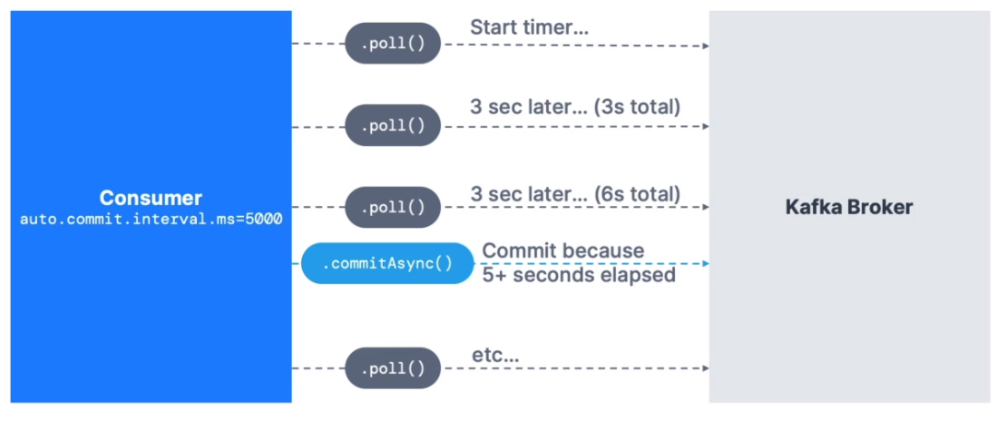

# Apache Kafka Manual

**Based on Apache Kafka 3**

---

Created as an open-source project by LinkedIn written in Java and Scala, Apache Kafka is a tool to decouple data streams & systems, meaning that it is a layer between the source system generating/streaming data (eg. financial transaction, user interactions with websites) to a target system (eg. database, analytics, emails..). It is a distributed system highly scalable, with high performance (very low latency which give it the name of `real-time system`).

Among its many use cases, the most relevant are:
* messaging system
* activity tracking
* gather metrics from different locations
* logs gathering
* stream processing
* integration with big-data technology

For example, Netflix is using Kafka for real-time recommendations to users, Uber to gather users and driver data and forecast surge pricing in real time, LinkedIn for spam detection and better recommendation. In all this use cases, kafka is only the layer of transportation!


## Topics

`Topics` are a particular stream of data, we can associate them to a table in a database but without all the constraints a table has. Following a list of Topics' features:


* We can have as many topic as we want a these will be distinguish by their unique name. 
* Topics can store any kind of message format and the sequence of messages is called data stream
* Topics can't be queried, but read by other kafka objects (Producers and Consumers)
* Topics data are **immutable** and are kept in memory for a fixed amount of time (usually a week)

We can divide a Topic in several partitions, and each partition will store data sequentially with an incremental id called `offset`; this offset won't be reused not even when older data are deleted. The order a data stream into a Topic is preserved only inside a partition. Data are assigned to partition randomly unless a `key` is provided.

### Topic replication factor

The replication factor is a property of the topics and by default is set to 1. Essentially it represents a safety measure in the event of the loss of a broker. In fact, if the replication factor is set to a number > 1 it means that we will have an exact replica of the topic and its partition on more than one broker.

If we have replicas, we also need a `leader broker`, i.e. the broker that host the original partition. At any time, only one broker can be the leader for a given partition and it will be this broker that will communicate with the Producers to receive data.


In the img above, `broker 101` is the leader for `partition 0` while `broker 102` for `partition 1`. If the replicas are well performed than we can say that **each partition has one leader and multiple ISR in-sync replica**.

Producers and Consumers can only write and read data from the leader broker of a specific partition; the replicas are de facto back-ups that will become leader partition only in the case of an error in the leader partition (in older version of kafka consumers can read also from replicas).

### Topic durability

The replication factor give a safety redundance to topic and partitions and as a rule we can say that: **with a replication factor of `N` we have a redundancy of `N-1` brokers**, meaning that we can lose up to N-1 broker and still be able to recover our data in sone of the broker in the cluster.

## Producers

Producers write data to Topics partitions, and it them to decide a priori to which partition to write. they are able to automatically recover in case of a broken failure. Producers send a `key` along with the stream of data (string, number, binary etc.) and this key serve as a ruler to distribute data among the topic's partitions. If the `key=null` than data are sent `round-robin` so that there is an even distribution among partitions (round-robin means that the receiving partition change each time in a circular fashion); if `key!=null`, i.e. we specify a key to be attached to the data stream, then we are sure that all messages that share the same key will be located in the same partition thanks ato a specific hashing function (it is the `kafka partitioner` that is responsible to determine by the key hash in which partition send a particular message) (e.g the gps data of a particular truck, we want to have them all in the same partition, so that also the temporal ordering will be guaranteed, hence we specify a key based, for example, on the particular truck id).

From kafka > 2.4 the round-robin behavior has been replaced by a more performant message distribution to partitions: the `sticky partitioner`. With this algorithm the producer will stick to a single partition until the batch size is reached or the linger.ms delay is passed, then it will send the batch (bigger then before) and switch partition. The latency is greatly reduced.

### Producer Acknowledgements (acks)

Producers have a property named `acks` (stands for Acknowledgement) that indicates if the producers will wait to receive a confirmation of receipt from the topics. In particular, if:

* `acks=0` producers won't wait for any confirmation (possible data loss), but the network overhead is minimized (faster)
* `acks=1` producers will wait only the confirmation from the leader broker (limited data loss); there is no guarantee of replication
* `acks=all` (or -1) producers will wait for confirmation from both leaders and replicas (no data loss)
  * goes hand-to-hand with the `min.insync.replica=2` option; if = 1 only the nroker leader needs to succesfully ack, if = 2 (suggested, together with a replication factor of 3) at least also one replica needs to ack (and so on)

In summary, when `acks=all` with `repliction.factor=N` and `min.insync.replicas=M` we can tolerate `N-M` broker loss to have the topic still available

### Producer's retries

We can specify a retry behavior of our producers, meaning that if there is a failure in the data transition, the producer will try again the action. from kafka 2.1 the setting for `retries` is set to a very high number (consider infinite) and we can set also a `retry.backoff.ms=100` by default equal to 100ms that is the time between each retry. We cna also specify a `delivery.timeout.ms=120000` default 120000ms (2 min.) that is the maximum time that a records may take to be delivered before running into a timeout error.

### Idempotent Producers

To avoid the possibility of duplicate commits in the topic by the producer (e.g. the producers send the data the first time, the topic receive it but the producer doesn't receive the ack back for a network error, therefore retries a second time and so there is a duplicate message in the topic) has been avoided with the introduction of idempotent producers that are able to identify duplicate messages. These are the standard from kafka 3.0 since guarantee a stable and safe pipeline. To set it manually:

* `producerProps.put("enable.idempotence", true);` # this is JAVA

### Producer's compression

Storage is expensive, and the amount of data received by a stream can become huge pretty fast, therefore it is important to add a compression to the text-based data coming from producers (usually JSON). Compression is enabled at producer level, therefore the broker configuration don't change, with the property `compression.type`, that is default to `none` but can switched to `gzip`, `snappy`, `lz4` or `zstd`. The bigger is the batch of message to compress, the more effective is the compression itself.

Batching can be improved by two settings at producer level:

* `linger.ms`: default is 0, add a small delay to batch sending, helping to increase the batch size
* `batch.size`: default 16KB, can be increased improving compression and efficiency, a message bigger than the batch size won't be batched, however if we set a number that is too high we are going to waste memory (we can use the kafka producer metrics tp analyze the traffic and chose the best value of batch size).


Compression can be tweaked also at broker level, where the default behavior is `compression.type=producer`, meaning that the broker take the compressed messages from the producer and directly write them to the topic without recompression (best choice); we can also set a specific type of compression for the broker but this may cause the need of decompressing and recompressing the data (CPU overhead).

## Consumers

Consumers implement the `pull-model` and are the actors devoted to read data from topics. They magically know from what server (broker) read data from adn how to recover in case of server failure. Consumers can be assigned to a single topic or to multiple ones and they read data in order from the lowest offset within each partitions. Since the key-value pair has been serialized by the producer, the consumers has also the role to deserialize the message to make it human readable.

**N.B. is it mandatory to NOT change the serialization/deserialization type during the lifecycle of a topic, otherwise we will break the stream!**. If we need to change the type we have to create a new topic instead.

### Consumer-group

A consumer-group is a group of one or more consumers that read from the same topic. We can have one consumers receiving all the data from all the partitions, and in this case it will form a consumer-group on its own, or on the opposite one consumer for each partition (actually we could have even more consumers than partition but in that case, some of them will be necessarily inactive since we **can have only one reading per partition per consumer-group**).

Often, we have multiple consumer-groups, each one related to a specific end application, therefore, we will have multiple consumers reading from the same partition but these consumers won't belong to the same consumer-group.

### Consumer-offsets

Kafka can store th offset at which a particular consumer-group has been reading, meaning that periodically (or at least once), an offset is committed to the topic named `__consumer_offsets` by the server in order to be able to restore the reading from that offset (e.g. in case of a system failure)


By default, the Java Consumer will automatically commit the offset at least once, but there are different strategies possible:

* `at least once,` (most common) the offset is committed after the message is processed in order to be able to read the message again in case something goes wrong. This can produce duplicate message, therefore our code need to check for that (not an issue if the process is `idempotent`).
* `at most once` (unsafe) the commit is instant with the message receipt, therefore in case something goes wrong the message is lost.
* `exactly once` possible only when we are reading/writing from/to kafka itself using the Transactional API (with kafka Streams API)

The commit strategy of the offset can be specified whe using a Java Consumer API; for example we can specify the parameters `auto.commit=true` and `auto.commit.interval.ms=5000` as the max time that can elapsed from one commit to the other. In this way we are going to process the messages Synchronously (if we were processing messages asynchronously we wil find us in an `at most once` situation -> unsafe).

We can potentially disable the `auto.commit` strategy but we need to encapsulate the poll process in a function that handle the batch and determine the condition for which a commit is to be performed (e.g. an amount of time or the size of a batch).



## Messages anatomy


How are composed the messages sent by the producers to the topics? Has we have seen, we have a key (optional), a value (the actual message), the compression adopted, a series of optional key-value pairs headers, the partition and the offset of destination and a system/user-specified time-stamp. Moreover, since kafka I/O only communicates in bytes, we need to specify one of the many built-in serializer, ie.e hashing keys that transform keys and values into binary format.


## Brokers

Broker is just the alias name of kafka for a server and the name derives from the fact that it both receives and sends data. A Kafka cluster is the composition of multiple brokers where each one of them is identified by an id. When working on a cluster, we only need to know how to connect to a single broker (called `bootstrap broker`) because after that the client will be able to connect to any other broker in the cluster. Once the kafka client attempt a connection to one of the brokers, the broker send back a list of all the other brokers present in the cluster (`smart client`).

One of the power of kafka is that it `scales horizontally` meaning that the number of topics and partitions per topic we have are distributed uniformly across the brokers. The more brokers the more is the topics distribution.


### Zookeeper

Zookeeper has been the reference software to use kafka from version 2.x (as a matter of fact you can't use kafka without it until version 3.x). It is essentially a manager for brokers (track the in a list), helps in leader election in case of leader loss, sends notification to kafka in case of changes in topics, brokers etc..

Zookeeper works with an odd number or servers (usually max is 7); it has one leader for writing data while the other servers are for reading (followers); it doesn't hold any Consumers data.

#### When to use it then?

+ for kafka brokers until kafka 4.0 is out since it is still not  `production-ready`
+ `NEVER` for kafka clients for reasons of security and migration issues

### Kafka Raft (KRaft KIP-500)

From version 3.x we can still work with zookeeper but is not mandatory anymore, instead we have an alternative called `Kafka Raft`. From version > 4.x we won't have zookeeper no more. With KRaft we will have a huge scale up in number of partition per cluster and an improvement in stability, maintenance, monitoring, security, recovery and shutdown. However in version 3.x is still not production ready.


[back to Top](#apache-kafka-manual)

---

# Starting Kafka

Starting kafka may not be trivial depending on the OS we are on. For a no-brainer solution we can usi Ui platforms such as https://www.conduktor.io/kafka/starting-kafka

## On Linux

Depending on the binaries downloaded from the apache kafka website.

First run `zookeeper`:

* zookeeper-server-start.sh -daemon  ~/kafka_2.12-3.2.0/config/zookeeper.properties 

Then `kafka`:

* kafka-server-start.sh ~/kafka_2.12-3.2.0/config/server.properties

---

# Kafka CLI

## kafka-topic.sh

The following command will allow us to create our first topic, specifying its name, the number of partitions and the replication factor (if we have a cluster with more than one broker.. not the case).

* `kafka-topics.sh --bootstrap-server localhost:9092 --create --topic [topic_name] --partitions [num_of_partitions] --replication-factor 1`

We can check the available topics with the command `--list`:

* `kafka-topics.sh --bootstrap-server localhost:9092 --list`

And to have a more precise description of a particular topic we use the `--describe` option. From the description we can see the partitions listed and their broker leader.

* `kafka-topics.sh --bootstrap-server localhost:9092 --describe --topic [topic_name]`

Without specifying the `[topic_name]`, we are going to describe all the available topics.

To delete an existing topic use the `--delete` option (not working on windows):

* `kafka-topics.sh --bootstrap-server localhost:9092 --delete --topic [topic_name]`


## kafka-console-producer.sh

Opening a producer we are able to send data to the partitions of our topics. The most basic way to produce data is the following:

* `kafka-console-producer.sh --bootstrap-server localhost:9092 --topic [topic_name]`

this will open a prompt where we can type messages that are sent to the topic. If we try to produce data to a non existing topic, kafka will create one for us, by default with one partition and a replication factor of 1 (at first it will sent a warning while trying to decide at which leader attach the newly created topic).


If nothing is specified, like above, the default `key` of the producer will be `none`; instead, if we want to produce with a key we need to specify two properties: the `--property parse.key=true` to tell the producers that we are going to insert data with a specific key, and `--property key.separator=[separator]` to specify which is the character that separate the key from the message.


* `kafka-console-producer.sh --bootstrap-server localhost:9092 --topic [topic_name] --property parse.key=true --property key.separator=:`

In this case we are specifying that the separator is a colon `:` therefore what comes before the colon is the key and what is after is the message.

```sh
> key1:a message
> key2:another message
```

Once we have specified `parse.key=true`, if we try to sent a message without key (i.e. without separator)


## kafka-console-consumer.sh

Opening a consumer we are able to read what the producers are sending to the topics. N.B. by default, the consumers will star to read from the end of the topic, therefore if messages have been sent before, we want see them.
To call a consumer with default properties, the syntax is the following:

* `kafka-console-consumer.sh --bootstrap-server localhost:9092 --topic [topic_name]`

to read the entire topic (also what has been written before we open the consumer) we need to explicitly set the option `--from-beginning`. We need to be careful thou, because we may see the messages read in an apparently random order (anyway different from our insertion order); this is because, if we have more than one partitions, messages are spread evenly across them and they can be retrieved in order only inside the same partition.

If we want the consumer's messages to be more informative, there are a bunch of property that we can specify; for example, the following will print all the messages from the beginning, with their timestamp and their key:

* `kafka-console-consumer.sh --bootstrap-server localhost:9092 --topic [topic_name] --from-beginning --formatter kafka.tools.DefaultMessageFormatter --property print.timestamp=true --property print.key=true --property print.value=true`


## consumers-group

To leverage the scalability of kafka we knw that we can group consumers into consumers-group, and each consumer in a group is able to read from one partition (only one consumer per partition). We can have a consumer group with more consumers than the number of partitions in the topic we are reading but those in excess will be inactive. To create a consumer belonging to a consumer group:

* `kafka-console-consumer.sh --bootstrap-server localhost:9092 --topic [topic_name] --group [group_name]`

now the consumers is part of the `[group_name]` consumer-group, and each new consumer we will create with the same group name will belong to the group. The messages send by the producer will be spread evenly among the active (one per partition) consumer of the group.

When working with a consumer-group we can,t specify the option `--from-beginning` to read everything inside the topic because once the group is created an `offset` is set and the group will read from there on.

Of course, we can have more than one consumer-group (an this is the real-case scenario, e.g. more end-application using the same data for different purposes) and each consumer-group will receive all the messages produced.

## kafka-consumer-groups.sh

With the consumer-groups CLI we are able to manage, inspect, delete our consumer-groups. For example, if we want to list our consumer-groups: 

* `kafka-consumer-groups.sh --bootstrap-server localhost:9092 --list`

or if we want specific information about a consumer-group we can:

* `kafka-consumer-groups.sh --bootstrap-server localhost:9092 --describe --group [group_name]`

among the info we will find the topic and the partitions assigned to the group, the `current` the `log-end` and the `lag` offset (current and log-end will coincide if we have read up to the tail of the topic, otherwise the lag will be > 0) and the `consumer-id` which will tell us which consumer of the group is assigned to which partition.

### reset the offset

Sometimes it can be useful to reset the offset created by the consumer-group to re-read the topic from the beginning. To reset the offset we have to specify the `--reset-offsets --to-earliest` and specify the topic to reset or directly reset the offset off all existing topics with the flag `--all-topics`.

* `kafka-consumer-groups.sh --bootstrap-server localhost:9092 --group [group_name] --reset-offsets --to-earliest --execute [topic_name]`

N.B. we cannot reset the offset if a consumer is running.

With the flag `--to-earliest` we want to offset 0, but it can be usefull to rewinde the offset only of few steps; for this we use the flag `-shift-by -[number]` where `[number]` is how many step back we want to take from the current offset. 