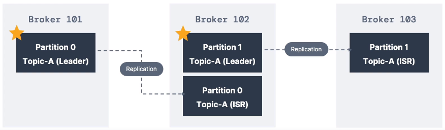
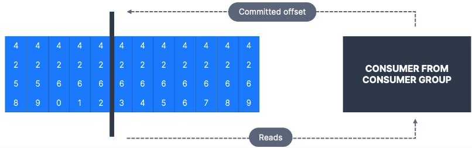

# Apache Kafka Manual

**Based on Apache Kafka 3**

Created as an open-source project by LinkedIn written in Java and Scala, Apache Kafka is a tool to decouple data streams & systems, meaning that it is a layer between the source system generating/streaming data (eg. financial transaction, user interactions with websites) to a target system (eg. database, analytics, emails..). It is a distributed system highly scalable, with high performance (very low latency which give it the name of `real-time system`).

Among its many use cases, the most relevant are:
* messaging system
* activity tracking
* gather metrics from different locations
* logs gathering
* stream processing
* integration with big-data technology

For example, Netflix is using Kafka for real-time recommendations to users, Uber to gather users and driver data and forecast surge pricing in real time, LinkedIn for spam detection and better recommendation. In all this use cases, kafka is only the layer of transportation!

## Topics

`Topics` are a particular stream of data, we can associate them to a table in a database but without all the constraints a table has. Following a list of Topics' features:

* We can have as many topic as we want a these will be distinguish by their unique name. 
* Topics can store any kind of message format and the sequence of messages is called data stream
* Topics can't be queried, but read by other kafka objects (Producers and Consumers)
* Topics data are **immutable** and are kept in memory for a fixed amount of time (usually a week)

We can divide a Topic in several partitions, and each partition will store data sequentially with an incremental id called `offset`; this offset won't be reused not even when older data are deleted. The order a data stream into a Topic is preserved only inside a partition. Data are assigned to partition randomly unless a `key` is provided.

### Topic replication factor

The replication factor is a property of the topics and by default is set to 1. Essentially it represents a safety measure in the event of the loss of a broker. In fact, if the replication factor is set to a number > 1 it means that we will have an exact replica of the topic and its partition on more than one broker.

If we have replicas, we also need a `leader broker`, i.e. the broker that host the original partition. At any time, only one broker can be the leader for a given partition and it will be this broker that will communicate with the Producers to receive data.

In the img above, `broker 101` is the leader for `partition 0` while `broker 102` for `partition 1`. If the replicas are well performed than we can say that **each partition has one leader and multiple ISR in-sync replica**.

Producers and Consumers can only write and read data from the leader broker of a specific partition; the replicas are de facto back-ups that will become leader partition only in the case of an error in the leader partition (in older version of kafka consumers can read also from replicas).

### Topic durability

The replication factor give a safety redundance to topic and partitions and as a rule we can say that: **with a replication factor of `N` we have a redundancy of `N-1` brokers**, meaning that we can lose up to N-1 broker and still be able to recover our data in sone of the broker in the cluster.

## Producers

Producers write data to Topics partitions, and it them to decide a priori to which partition to write. they are able to automatically recover in case of a broken failure. Producers send a `key` along with the stream of data (string, number, binary etc.) and this key serve as a ruler to distribute data among the topic's partitions. If the `key=null` than data are sent `round-robin` so that there is an even distribution among partitions (round-robin means that the receiving partition change each time in a circular fashion); if `key!=null`, i.e. we specify a key to be attached to the data stream, then we are sure that all messages that share the same key will be located in the same partition thanks ato a specific hashing function (it is the `kafka partitioner` that is responsible to determine by the key hash in which partition send a particular message) (e.g the gps data of a particular truck, we want to have them all in the same partition, so that also the temporal ordering will be guaranteed, hence we specify a key based, for example, on the particular truck id).

### Producer Acknowledgements (acks)

Producers have a property named `acks` (stands for Acknowledgement) that indicates if the producers will wait to receive a confirmation of receipt from the topics. In particular, if:

* acks=0 producers won't wait for any confirmation (possible data loss)
* acks=1 producers will wait only the confirmation from the leader (limited data loss)
* acks=all producers will wait for confirmation from both leaders and replicas (no data loss)

## Consumers

Consumers implement the `pull-model` and are the actors devoted to read data from topics. They magically know from what server (broker) read data from adn how to recover in case of server failure. Consumers can be assigned to a single topic or to multiple ones and they read data in order from the lowest offset within each partitions. Since the key-value pair has been serialized by the producer, the consumers has also the role to deserialize the message to make it human readable.

**N.B. is it mandatory to NOT change the serialization/deserialization type during the lifecycle of a topic, otherwise we will break the stream!**. If we need to change the type we have to create a new topic instead.

### Consumer-group

A consumer-group is a group of one or more consumers that read from the same topic. We can have one consumers receiving all the data from all the partitions, and in this case it will form a consumer-group on its own, or on the opposite one consumer for each partition (actually we could have even more consumers than partition but in that case, some of them will be necessarily inactive since we **can have only one reading per partition per consumer-group**).

Often, we have multiple consumer-groups, each one related to a specific end application, therefore, we will have multiple consumers reading from the same partition but these consumers won't belong to the same consumer-group.

### Consumer-offsets

Kafka can store th offset at which a particular consumer-group has been reading, meaning that periodically (or at least once), an offset is committed to the topic named `__consumer_offsets` by the server in order to be able to restore the reading from that offset (e.g. in case of a system failure)

By default, the Java Consumer will automatically commit the offset at least once, but there are different strategies possible:

* at least once, the offset is committed after the message is processed in order to be able to read the message again in case something goes wrong. This can produce duplicate message, therefore our code need to check for that.
* `at most once` the commit is instant with the message receipt, therefore in case something goes wrong the message i lost.
* `exactly once`

## Messages anatomy

How are composed the messages sent by the producers to the topics? Has we have seen, we have a key (optional), a value (the actual message), the compression adopted, a series of optional key-value pairs headers, the partition and the offset of destination and a system/user-specified time-stamp. Moreover, since kafka I/O only communicates in bytes, we need to specify one of the many built-in serializer, ie.e hashing keys that transform keys and values into binary format.

## Brokers

Broker is just the alias name of kafka for a server and the name derives from the fact that it both receives and sends data. A Kafka cluster is the composition of multiple brokers where each one of them is identified by an id. When working on a cluster, we only need to know how to connect to a single broker (called `bootstrap broker`) because after that the client will be able to connect to any other broker in the cluster. Once the kafka client attempt a connection to one of the brokers, the broker send back a list of all the other brokers present in the cluster (`smart client`).

One of the power of kafka is that it `scales horizontally` meaning that the number of topics and partitions per topic we have are distributed uniformly across the brokers. The more brokers the more is the topics distribution.

### Zookeeper

Zookeeper has been the reference software to use kafka from version 2.x (as a matter of fact you can't use kafka without it until version 3.x). It is essentially a manager for brokers (track the in a list), helps in leader election in case of leader loss, sends notification to kafka in case of changes in topics, brokers etc..

Zookeeper works with an odd number or servers (usually max is 7); it has one leader for writing data while the other servers are for reading (followers); it doesn't hold any Consumers data.

#### When to use it then?

+ for kafka brokers until kafka 4.0 is out since it is still not  `production-ready`
+ `NEVER` for kafka clients for reasons of security and migration issues

### Kafka Raft (KRaft KIP-500)

From version 3.x we can still work with zookeeper but is not mandatory anymore, instead we have an alternative called `Kafka Raft`. From version > 4.x we won't have zookeeper no more. With KRaft we will have a huge scale up in number of partition per cluster and an improvement in stability, maintenance, monitoring, security, recovery and shutdown. However in version 3.x is still not production ready.

