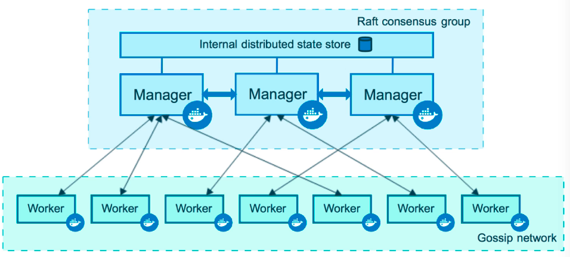
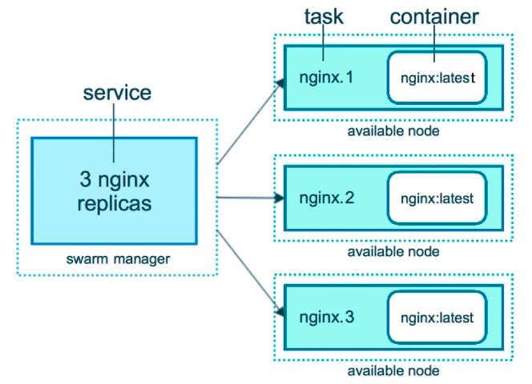
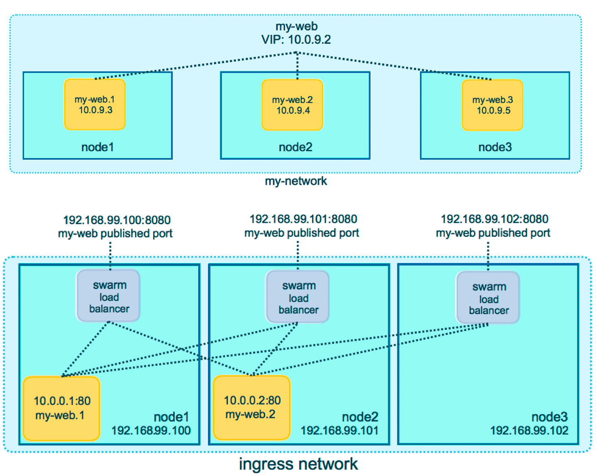

# Docker Manual

For the official manual -> <https://docs.docker.com/>

Useful tutorials @:

*https://training.play-with-docker.com/*

Useful resources @:

*https://github.com/veggiemonk/awesome-docker#cli-tools*

---

Released in 2013, Docker represents a huge shift in the IT ecosystem introducing `containerization`. Basically a containers reduce the complexity software development lifecycle serving in a single platform the tools required for deploying, testing even when the application is developed in different languages, frameworks, or on different clouds and so on. The maintenance of software is another crucial factor that has led docker to be a must. There is no need to rewrite code, it is just a different way of running and packaging an application and moving around an infrastructure.

<https://landscape.cncf.io/> is a fun link to appreciate the magnitude of the container based application that are out there.

## Docker Editions

Docker has two main edition: `CE` the free community edition and `EE` the paid enterprise edition. Since it is a technology that moves super fast, it is important to have always the latest version installed. Docker is native on Linux, therefore the direct installation can happen there. The version for Windows and Mac are run Docker on top of a VM since it is not directly supported by the OS. Another possibility is given by the cloud installation, on AWS for example, where Docker is preinstalled (usually on Linux) and has a number of special features ad hoc for cloud usage.

## Install on Ubuntu

N.B. Remember to enable virtualization on BIOS (right now Docker Desktop runs on a VM also on Linux)

To install on ubuntu, "simply" follows the instruction @ <https://docs.docker.com/engine/install/ubuntu/#set-up-the-repository>.

Once Docker is installed we can do some quick checks to very that it works properly (sudo is required):

* `docker` : to have a list of the possible commands (at the bottom)
  * the structure of commands is the following: `docker <command> <sub-command>`
* `docker version` : will show the Client and the Server (Engine) version installed, meaning they are communicating correctly
* `docker info`: returns a lot of information about the status of the containers in the machine and the engine configurations

<https://get.docker.com/> is an alternative to set up docker very fast on any machine (instruction inside!)

---

# Docker CLI

*<https://docs.docker.com/engine/reference/run/>*

Following a list of the most common docker command that can be used from the terminal:

## login-logout

* `docker login`

Until we don't logout we will have an authentication key stored in `.docker/config.json`, therefore if we are on an untrusted machine, always remember to:

* `docker logout`

## container side

* `docker container ls` - list the running containers; all the available with option `-a`
* `docker container top [container_name]` - list the active process in a container
* `docker container port [container_name]` - check if a port has been opened between host and container
* `docker container inspect [container_name]` - return container's data in JSON format
  * `docker container inspect --format '{{ .NetworkSettings.IPAddress}}' [container_name]` - select the container IP field from the JSON and return it [https://docs.docker.com/config/formatting/]
* `docker container stats` - shows a summary of the resources used by the active containers

## network side

* `docker network ls` - list the existing networks
* `docker network inspect [network_name]` - return network's data in JSON format
* `docker network create [network_name]` - create a new network with default *bridge* driver
* `docker network connect [network_name] [container_name]` - connect a container to a network

## pruning (cleaning)

`prune` command is useful to clean up images, volumes, caches etc.. here some usages:

* `docker image prune -a` remove all the images we are not using; we can replace image with any docker component, volumes, containers etc..
* `docker system prune` clean the entire OS

## generals

* `docker system df` to see space usage od docker environment

---

# Containers

First of all, what is the difference between an `image` and a `container`? An image is the binary, the libraries and the source code of an application while the *container is running instance of that image*.
therefore, we can have many containers running the same image.

Let's see what does it mean to create a mock-up container and what are the steps that docker performs in order to make it viable.

`docker container run --publish [host_port]:[container_port] --name [container_name] -detach [image]:[version]`

In this line there is a lot to process; first of all we are calling the docker command `conatiner` with the sub-command `run`, then we are specifying `--publish` meaning that we want to open a communication port between the client and the host of the container on the same port `80:80`. after that we specify the name of the host with `--name` and this has to be an unique attribute of the container, if not specified docker will come up with one random name on its own; with the keyword `-detach` we are telling docker to run the container silently and not on the terminal. At last we specify the image we want to load into the container, `nginx` in this case, and the specific version we want.

If we only need the container temporarily, we can specify the `--rm` option to destroy the container once is closed.

Under the hood, docker is looking for the nginx image in the local cache and if not found it will look in the Docker Hub (standard image repository), it will download the version specified, create a container based on the chose image, giving it a virtual IP on a private network inside docker engine, open up the communication port on the host and on the container, and finally starts the container.
  
## How to interact with a container

Now we have seen how to create a container, but how do we access it? We might think that an SSH is required in order to connect to the inside of a container, instead, thanks to the docker cli there is no need since we can easily get a shell inside the container. To create a new container interactively (eg. opening bash shell):

`docker container run -it --name [container_name] [image] bash`

We can see two additional option that are `-it` where:

* `i` stands for interactive
* `t` is the abbreviation for `tty` which simulates a real terminal, similar to what ssh does
  
After specifying the image we are going to containerize, we can add optional arguments such as `bash` in this case, which is a common shell that we can usually find in a container.

Running this command will open a prompt with root privileges. Type `exit` to exit the prompt.
After exiting, we can restart the interactive container with:

`docker container start -ai [container_name]`

## interact with an existing container

We have seen how to create a container and star it interactively, but what if the container was already there? In this case we need the `exec` command:

`docker container exec -it [container_name] bash`

The exec command runs an additional process on the already running container, therefore, exiting the interactive process won't stop the container.

N.B. if we are trying to lunch interactively something that is not installed inside the container (e.g. bash is not installed in Alpine, a super lightweight distribution of linux) we will get the following error : *executable file not found in $PATH*

---

# Docker Networks

We have seen that when creating a container we can specify the option `-p` (for publish) in order to specify the host and the container listening ports. This essentially means that we are open port on our ethernet network, which has its own firewall, but what it might seem surprising is that our communication is not traveling directly to the container but it pass trough a `private virtual network` called `bridge` or `docker 0` (this is why the container won't share the host IP). As a matter of fact, all containers are attache to a private virtual network and between them they can freely communicate without the need to 'publish' a specific communication port. Instead, to talk to the host the `-p` need to be specified and only one container can be connected to that port.

The best practice is to create a new virtual network for each application (which can count more then one container), because in this way the different containers can talk freely between each other, while, for example, only one is able to talk directly to the host (reducing security issues and traffic).

For the same reason, is better to have containers, that may interact together, on the same private virtual network because otherwise, if a communication is required, information must pass first to the host and then redirected.

N.B. Docker is known to be a **Batteries included, but removable" framework, meaning che most of the default options works fine almost every time but can also be tweaked at user's will. For example, what we have just described about networks, bridges and containers is the default docker behavior, however we can attach containers to more than one bridge, or skip entirely the bridge and connect directly to the user IP etc..

## Networks management

Similarly as we create containers, we can create and inspect networks as well as connect and disconnect networks from containers (similarly to how we plug and unplug hardware in our machine).

If we want to list the available networks we can `docker network ls` and by default we will see 3 networks:

* `bridge\docker0` network, is the default vn that bridge to the NAT's firewall to the physical network the host is connected to
* `host` network, is the way we have to skip the vn of docker to have a direct connection to host, gaining performance but sacrificing security
* `none` network, the equivalent of an interface of our machine that has nothing attached

With `ls` we can also see a column name `driver` which is an extension (built-in or third parties) that gives features tho the network; when we create a new network with `docker network create [network_name]` the default driver `bridge` is used which create a vn locally with its own subnet.

When creating a container we can directly specify the `--network` option to connect to a specific netowrk or, vice-versa, we can `docker network connect [network_name] [container_name]` to connect an existing container to a network.

## Connection with DNS

*how DNS works [https://howdns.works/ep1/]*

The structure of dockers container is very mutable, containers get created/deleted, shrinked/expanded, connected/disconnected etc.. therefore, relying on their IP address for communication is an anti-pattern in the logic of the framework. Instead, the built-in solution to this problem is to use `DNS naming`; as a matter of fact, the name we give to a container can be used by networks as DNS; in the same way if we create a second container on an existing network, the two container will be able to find each other using their name an not their IP.

---

# Images

An image of an application is set of binary and dependencies together with the metadata about the image and how to run it. Their are not a complete OS because it is the hosting platform (docker in this case) that provides the kernel and the drivers (while a VM needs to set up an entire OS to run). An image can be as small as a single executable file and as big as a full operating system (like an Ubuntu distribution).

## Docker Hub

Docker hub is the biggest repository for containerized images <https://hub.docker.com/> . Among the images we have `official` ones (provided and curated by docker team), that can be distinguish by the image name without any slash, `user\company images` which have the account/company name and a slash before the name of the image.

When looking to a docker-hub image description, the first thing we will found are the `supported tags`; these are the available version that we can `pull` directly using docker, and the specific tag we can use to download a specific version (e.g. `docker pull nginx:1.11.9`)

We can have a look at all the images we have downloaded with:

* `docker image ls`

and we can also check the tag related to the specific image.

### Automated building

*https://docs.docker.com/docker-hub/builds/#:~:text=Docker%20Hub%20can%20automatically%20build,to%20build%20into%20Docker%20images.*

We can link our code from github to dockerhub and set an automated building routine, meaning that each time some code is pushed to a specific branch we decided, it gets build by docker automatically and an email is sent to us as a verification of the building status.

### Docker Registry

*https://docs.docker.com/registry/configuration/*

*https://docs.docker.com/registry/garbage-collection/*

*https://docs.docker.com/registry/recipes/mirror/*

N.B. build your own registry only if you strictly have to; otherwise there are plenty of registry out there with a lot of built-in functionalities! (AWS, GoogleCloud etc...)

At its core, docker registry is a web api and a storage system written in Go, that serves as a storage for private images; it has very few features compared to docker hub but it can be useful for small teams. By default it is an https that runs on port 5000. Docker engine  can talk only to https website which have a proper TLS certificate, exception made for local host

To create a registry:

* `docker container run -d -p 5000:5000 --name registry registry`

Simple as that, we have created our local registry at `localhost:5000` and now we can start inserting our own image inside the registry bu assigning a `tag`:

* `docker tag [tag_name] 127.0.0.1:5000/[image_name]`

Now that our image is tagged to the correct address we can push it, and docker will understand that the destination is not docker hub but our local registry:

* `docker push 127.0.0.1:5000/[image_name]`

Now, whenever we need this image, or for example if we are building our own image to be place in a swarm stack, we can refer to our own registry and pull the image:

* `docker pull 127.0.0.1:5000/[image_name]`

Finally we can create a registry using a bind mount to store data:

* `docker container run -d -p 5000:5000 --name registry -v $(pwd)/registry-data:/var/lib/registry registry`

An example playground can be found here *https://training.play-with-docker.com/linux-registry-part2/*

#### Docker registry on Swarm

On swarm the registry operates the same way on localhost but thanks to the routing mesh all the nodes can see the port 5000 exposed by docker for the registry. Since we are in a swarm environment we need to use the **docker service**:

* `docker service create --name [registry_name] -p 5000:5000 registry`

Now we can again tag our image and then push it to the local swarm registry and eventually building it as a service:

* `docker service create --name [image_name] -p [port]:[port] --replicas [num_of_replicas] -d 127.0.0.1:5000/[image_name]`

## Images Layers

When we first build an image it is like having a blank sheet upon which we are going to create layers during its life by pulling data or simply changing metadata. The complete history of an image can be inspected with:

* `docker image history [image_name]`

The cool part of images' layers is that they are unique entities that are `cached` meaning that if two image needs the same OS we won't need to build it twice but they will share the layer saving a lot of space!

Instead, if we want a deep look into the `image metadata` we can inspect it:

* `docker image inspect [image_name]`

## Copy On Write

The image is basically a `read-only` file that is pulled once from docker-hub and then used by the containers. Only the changes in those container will be cached, but the source image, and the initial storage size will be the same. Therefore, starting a container is a very small operation because it means essentially only to add a small layer upon the image.

## Image Tags

The Tag is essentially a **pointer to a specific commit od the image**. Tags can be numbers or words, and those listed on the same row in docker-hub description are all aliases that point to the same image id.

We can also `re-tag` an existing image, with some layer of changes we have performed, and push it to docker-hub:

* `docker image tag [image_name]:[tag_name]  [my_tag]/[image_name]:[tag_name]`

This will create an image with the same id as the original but a new repository (that doesn't exist on docker-hub until we push). The `:[tag_name]` is optional, unless we have more then one version of the same image; if not we can omit it.

Now, to push we can:

* `docker image push [my_tag]/[image_name]`

Moreover, we can add an additional tag to our custom image, for example to distinguish development and production build:

* `docker image tag [my_tag]/[image_name] [my_tag]/[image_name]:[another_tag]`

and then push it:

* `docker image push [my_tag]/[image_name]:[another_tag]`

N.B. if the `[another_tag]` image won't differ from the original we already pushed, we will receive a message `Layer already exists` since docker has already cached the changes up to this point.

## Dockerfile

*<https://docs.docker.com/develop/develop-images/dockerfile_best-practices/>*

The Dockerfile is the setup script that contains the instructions used by docker to build an image. Here a link to a sample Dockerfile to build nginx[link-to-sample-docker-file](sample_Dockerfile).

The main part of the Dockerfile are:

* `FROM` : is a must an usually specify a minimal Linux distribution like debian or alpine. Actually FROM can also point to an official docker-hub image upon we want to built our own custom image. Building upon an existing application image we can also inherit the EXPOSE and CMD commands.
* `ENV` : environment variable, very important because is the way to inject key-values into the container that can be used later on also inside the same dockerfile
* `RUN`: execution of shell commands, the order is important (top-down), the first are usually installations requirements for the container to run. The run has exposure to all the commands that come shipped with the reference OS distribution (e.g. debian or alpine). We can have very long commands that are chained with `&&` symbols; this is to create a single layer to save space since the first are usually common configuration instructions
* `WORKDIR`: is simply a cd to a folder, use this and not `RUN cd /some/path`
* `COPY`: copy files in to the image
* `EXPOSE`: expose the listed ports to the docker virtual network; wee still need to use `-p` to open this ports to the host. By default no TCP or UDP connection are exposed
* `VOLUME`: create a volume path to store persistent data inside the container that will outlive the container itself
* `CMD`:is required, can be only one, and are the commands that will be launched every time we start an image from a container

## Building an Image

Once the Dockerfile is ready, to build an image we can simply:

`docker image build -t [tag_name] -f [Dockerfile_name] [location_for build]`

we will see that each command is executed on a different line and an unique id is associated with them, this is because we are creating layers that, if nothing changes in future build, the won't need to be processed again since they have been cached by docker.

N.B. remember the order!! once a command line in the dockerfile is changed, all the following will need to be rebuilt, therefore is very important to put first the setup that are unlikely to be modified and at the bottom those that are subjected to possible/frequent changes during the development of our project.

### extending existing images

Instead of building entire new images from scratch what we often might doing is to take an existing build and then add stuff of our particular interest, then recompile the image and push it to our docker hub repository. At the link a dummy example of how we can start from the nginx built and add a file to it
[link-to-extending-exiting-images](add_file_to_image_Dockerfile). One of the benefit in using an existing file is that we don't need to specify a complete Dockerfile because the instruction we don't need to change will be taken directly from the source Dockerfile (such as the CDM).

---

# Container Lifetime & Persistent Data

Containers can be defined as `immutable infrastructure` meaning that they essentially can be thrown away (mutable) but their images never change, can be upgraded/modified and simply re-deployed in a new container (we don't change it while it is running). But what happens to our unique data processed in the container (like databases, files, key values etc..)? Here comes an important concept that docker ensure: the `separation of concerns`, meaning that our data are not mixed up in the container that holds our application so that the image of the application can be updated while the data are stored safely. These data that should be kept separate from the mutability of the container are called `persistent data`; before containers it wasn't a problem since also the infrastructures were persistent (e.g. servers), but now with the concept of containers and application auto-scaling, how to handle persisted data is a key factor.

Docker use two solution to the problem of persistent data:

* `Data Volumes`: essentially a file path attached to a container at its creation
* `Bind Mounts`: essentially a sharing of a local directory into the container (the container sees it as a file path, it doesn't know it is coming from the host)

## Data Volumes

*<https://docs.docker.com/storage/volumes/>*

The first way in which we can tell the containers about a volume is in the dockerfile with the keyword `VOLUME` and a path associated to it. Essentially we are creating a folder in the container that outlive the container itself; in fact it has to be deleted manually. In the dockerfile we specify the path to the volume, and this path is relative to the container:

```sh
# from the mysql official dockerfile
VOLUME /var/lib/mysql
```

However if we inspect a container built with a volume, we will also find a `Mount` key that will specify that there is a volume, that its destination is the container path above, and that the `source` is actually a path to the host, where data are actually stored in order to outlive the container. We cna inspect the docker volume with:

* `docker volume ls`
* `docker volume inspect [volumeUniqueID]`

On linux we are actually able to navigate to the host path and see the data store; on Windows and Mac, since docker is running on a thin VM it is not so easy to access them. The problem is that inspecting directly the volumes (we can easily have more than one) we get no information on the volume side, i.e. to which container is it attached.

The solution to this problem is to use `named volume`, i.e. assign a specific and unique name to a particular volume related to a particular container/image.

*`docker container run -d --name mysql -e MYSQL_ALLOW_EMPTY_PASSWORD=True`**`-v mysql-db:/var/lib/mysql`**`mysql`

With the `-v` flag we are telling docker to create a volume for the container at the same path that we had specified in the dockerfile (it is actually an alternative), but in advance, we also specified a name with a colon in front of the path `mysql-db:` which will be the name of the unique volume. In this way, inspecting the volume we will have a custom name that will easily remind us to what purpose it was created, and in the same way, inspecting the container we will se a more human readable source path to the host.

Another way to create data volumes is using the command:

* `docker volume create`

in this way we are creating a volume that will be later on attached to a container, and the only utility of doing this is to  be able to `specify a custom driver` (default is 'local') and other metadata.

## Bind Mounts

*<https://docs.docker.com/storage/bind-mounts/>*

*bets choice for local development or local testing*

Bind mounts are nothing more than a mapping between a host and a container file directory. Like the volumes, it skips UFS, therefore data outlive any container tha may be deleted at some point. A bind mount can't be specified in the dockerfile, instead it needs to be an argument of our *container run* command, again under the flag `-v`:

* `... run -v [full_host_path]:[container_path]`

e.g. linking the present directory with the html directory of the nginx container; the container will be able to access everything inside the pwd folder.

* `docker container run -d --name nginx -p 80:80 -v $(pwd):/usr/share/nginx/html nginx`

instead of a name, we need to specify a full local host path to be mapped to the container path.

The strength of external mount to our containers is that we cna actually work inside the container without needing to access it interactively; we could develope our app in the shared folder and simply see the log on the container to check for errors.

---

# Docker Compose

*<https://docs.docker.com/compose/>*

*Never use docker compose in a production server, use swarm (even with a single node) and stack instead*

There will be few occasion where we will find a stand-alone solution to our problem therefore running in a single container; more often we will need to combine different services running on separate containers and here come in rescue `docker compose`.

Docker compose takes care of the relation between containers, creating a one solution for developer environment that can be run and setup in single file. It is composed by two pieces:

* a `YAML` file that contains the setup of containers, networks and volumes
* the CLI `docker-compose` that is used for local dev/test with the YAML files

Following a template of a `docker-compose.yml` file to understand how it is structured:

```yml
# version isn't needed as of 2020 for docker compose CLI. 
# All 2.x and 3.x features supported
# Docker Swarm still needs a 3.x version
version: '3.9'

services:  # containers. same as docker run
  servicename: # a friendly name. this is also DNS name inside network
    image: # Optional if you use build:
    command: # Optional, replace the default CMD specified by the image
    environment: # Optional, same as -e in docker run
    volumes: # Optional, same as -v in docker run
  servicename2:

volumes: # Optional, same as docker volume create

networks: # Optional, same as docker network create
```

## docker-compose CLI

While for Windows and Mac the docker-compose client comes shipped with the docker installation, on Linux we have a different binary to install. Docker compose is not a *production-grade* tool but it is ideal for local development and test. The two most common commands are:

* `docker-compose -f [name_of_yml_file] up`: to set-up and start all the container in the yml file
* `docker-compose -f [name_of_yml_file] down`: to stop and clean up all the containers

The `-f [name_of_yml_file]` is need only if the yml filename is different from `docker-compose.yml`.

We can use compose also to build/rebuild our custom image; by default docker compose first look into the cache for an already build image and if we want to rebuilt it we need to sepcify:

* `docker-compose -f [name_of_yml_file] up --build`

# Swarm

*<https://docs.docker.com/engine/swarm/>*

One of the premises of containers is that we would be able to deploy our app everywhere, despite the hardware, the OS, the provider etc. However, once an application as to scale out or scale up, when the number of containers become relevant, we need to answer some questions:

* how do we manage their lifecycle across many servers or instances?
* how can we ensure that containers are re-created if they fail?
* how can we replace a container without downtime for our app (**blue/green deploy**)?
* how to keep track of all the container status?
* how to create cross-node communications between containers?
* where do we store the private information like keys and passwords?

Here comes `Swarm Mode`, essentially a **clustering solution built inside docker**, born in 2016 to gradually answer the questions above. The idea is to have a single entity to manage which will handle all the problems related to cross-nodes/servers deployment, lifecycle, downtime, security etc..

**Swarm mode** is not enabled out of the box, but has to be explicitly started since the idea was not to affect the existing containers in any way.



The picture above gives an idea of the swarm ecosystem. We have `Workers` and `Managers` (that are essentially workers with the permission of controlling the swarm). The Managers are attached to a so called `Raft Database` which stores the configurations and the information needed by the managers to know their role inside the swarm (each manager contains a copy of the database). A manager can be a virtual machine or a physical host that is tunning a linux distribution or a windows server, and all these can communicate since they are in the same `control plane`. Managers sends order to workers, and workers can be promoted to manager eventually.

Looking at an example, since now we where used to **docker run** and deploy a single container at the time on the machine where the **docker CLI** was running; with the concept of swarm, we can tell a manager to perform multiple operations, like deploying more than one containers or replicate existing one (these action are called `task`). A single service can have multiple tasks and each task can be responsible of running a container. So, the **docker run** command is replaced by the `docker service`, like in the example below where we told the service to deploy a standard nginx container but with 3 replicas; therefore, the managers decide where to allocate the three nodes in the swarm but not just that, in reality the swarm api does much more than simply accept command from the user, instead it handles the allocation of IP to the tasks, their assignation to nodes, communicates constantly with the workers etc..



## Creating a Swarm

As told before, swarm mode must be enabled, and we can check its status by `docker info` and check for `Swarm: active/inactive`.

To initialize the swam we can simply:

* `docker swarm init`

and in a fraction of second we will have an active swarm with one node and all its functionality. Behind the curtain, there is a lot happening: root is signing a certificate to the swarm a this is issued to the first manager (to give him the power of manager), also a token is created that can be given to other nodes to join the swarm; the raft database is created an the config are stored and encrypted and shared between the managers (no config db is needed as backend of the swarm structure).

Once our swarm mode is active we can use the service command (replacing the docker run for single containers) and create a task for our manager to handle:

* `docker service create alpine ping 8.8.8.8` (n.b. the 'ping 8.8.8.8' is just to use a google dns to check if the container is working)

* `docker service ls` will show our active services, where REPLICAS is the number of active and requested container for that task, and docker will always ensure that these numbers match no matter what

* `docker service ps [service_name]` will finally shows the container created in the node.

Now nothing has changed from the standard **docker run** command for a single container. But hte power of the swarm is that now we can simply scale up our application, e.g increasing the number of replicas, by simply updating the service:

* `docker service update [service_id] --replicas 3`

et voila! with a simple command our manager created 2 new nodes with a copy of our container.

By doing `docker service update --help` we can see that there are a lot of options available, much more than the `docker update` we have used on a single container that basically is limited in the modification of resources allocated to the container. This is because the swarm is meant to be modified on the run without affecting the running containers at all (e.g. we could update one of the 3 replicas at the time thus having no downtime in the service of our app). The real difference it that with **docker service** we are not speaking directly to the containers but to the `orchestration system` of the swarm that will handle the operations in the most consistent manner.

## Rebalancing a service

It might happen that, when we have multiple containers and workers in our service, at some point the workload is unbalanced between the workers. We can force a reset by performing a service update as follow:

* `docker service update --force [service name]`

## Creating a Swarm with 3 Nodes

To create a 3 node swarm we can't simply use our local machine but we need a way to create 3 VM or something similar where install 3 instance of docker. The simples way to test a multi-node swarm is using `play-with-docker.com` a platform with a 4 hours session time where to play around. Alternatively, use <https://multipass.run/> to create multiple VM.

Once we have 3 working session of docker on 3 different machines or VMs, we can create the swarm. To do so, we have to init the swarm in one machine, which will at first hold the `leader manager` (only one manager can be leader). Actually, to initialize a swarm in an environment that has more than one ip at disposal we need to:

* `docker swarm init --advertise-addr [ip_address]`

Once we performed this action we will get in output the command to join a new node to the swarm together with the token requested (the token isn't something we need to save, it is stored in the swarm config (raft db) and can be retrieved at any time by simply digit `docker swarm join-token manager/worker` (manager or worker to get the appropriate token). We can decide to join a new node as worker or manager (or join it as worker and promote it later). the command is essentially this:

* `docker swarm join --token [token_code] [ip:port]`

And this has to be executed on the other machines, not where the swarm has been initialized. To promote a worker we can simply:

* `docker node update --role manager [node_name]`

If now we create again our service `docker service create --replica 3 alpine ping 8.8.8.8` with a replication factor of 3, the swarm will automatically spread our 3 nodes across the 3 different addresses.

## The Overlay Network

*<https://docs.docker.com/network/network-tutorial-overlay/>*

The same concept of `bridge network` that we had to communicate between different container on our local machine can be applied to swarm; In fact we can create a `--drive overlay` that is devoted to manage traffic inside the swarm (not coming to). Swarm can have none or multiple networks, depending on the application (e.g. a typical app will have a back-end network for a database, a front-end one and an API that communicates with the both). To create a swarm network the procedure is the same for a local one:

* `docker network create --drive overlay [network_name]`

Now we can connect to the swarm network our back-end service (e.g. a postgres instance):

* `docker service create --name [service_name] --network [network_name] -e POSTGRES_PASSWORD=[password] postgres`

N.B. Since the service pass through an orchestrator we wont see on the terminal the downloading and setup of the image

### Routing Mesh

*<https://docs.docker.com/engine/swarm/ingress/>*

The routing mesh is an `incoming network` that helps distributing the traffic across the service of our swarm to the proper task (there can be more then one task). It span across all the nodes in the swarm in order to perform **load balancing** of the traffic across the tasks of the service. The routing service works both **container-to-container**, balancing for example the traffic between different containers attached to the same worker, using a `VIP` (virtual ip) a **private ip that swarm puts in front of every services** (imagine a back-end and a front-end service; they wont talk directly to each other, the traffic would pass through the VIP and redistributed) or to redirect **external traffic** to any node of the swarm since these will all have the same published port open and ready to listen; then the traffic will be rerouted to the appropriate container.

This is super helpful because we don't need to know the exact location of the container (actually if it fails and it is recreated by the swarm orchestrator, it might be placed in a different node)



Looking at the first example in the image above, imagine we have created a swarm with 3 tasks, 3 container and 3 nodes, inside the **overlay network** docker creates a VIP that is mapped to the DNS name of the service (my-web). At this point, all the containers inside the swarm only need to use the same dns of the service and automatically, the VIP will balance the traffic among all the tasks in the service.

In the second example we see hoe the external traffic is handled: we have 2 task distributed on 2 nodes, both with the same DNS; each node is equipped with a `swarm load balancer` which is listening to the same published port and have the task to redistribute the traffic to the proper node/container

## Secret storage

*<https://docs.docker.com/engine/swarm/secrets/>*

*To be execute in the manager node of the swarm*

Swarm comes with the easiest solution for storing any kind of secrets (username & password, SSH keys, any private data etc..). Docker compose can store a file-based secret inside containers but is not secure. Secret can be assigned to single services or single workers and be accessed by them only; they are store in-memory on the raft db. To store a secret in swarm (and only in swarm!):

* `docker secret create [secret_name] [secrete_name.txt]`

or if we want to echo it directly from shell:

* `echo "myPassword" | docker secret create [secrete_name] -` : note that the final "-" means to read from stdin

Both the approaches have drawbacks, the first is saving a file on the storage where the service is running and the second has the command cached in memory (a root user could retrieve the command, hence find the password used).

Once we have the secrets stored, we can pass it to a service (and these will be available to all the task in the service) assign to the specific environmental variable of the particular image the proper file path; an example with a postgres image:

* `docker service create --name psql --secret psql_user --secret psql_pass -e POSTGRES_PASSWORD_FILE=/run/secrets/psql_pass -e POSTGRES_USER_FILE=/run/secrets/psql_user postgres`

We can also add or remove secrets on running service but these are immutable objects connect to the containers, therefore the containers will need to be recreated.

* `docker service update --secret-rm` . or --secret-add

## Stacks

*Compose file version >= 3.0*

*<https://docs.docker.com/engine/reference/commandline/stack/>*

*a stack deploy is a service update -> containers are recreated*

Stacks are `production grade compose file` for swarm and they can include definition for services, networks and volumes. We don't use the **docker service** to deploy, instead:

* `docker stack deploy -c [Compose_file_name] [Service_name]`: it manages everything from replicas, to recovery strategy, to overlay network, naming, labeling; **The only thing that a production grade tool shouldn't do is building images** since it takes to mush resources. The `-c` stands for "use a compose file to create the stack"

**N.B. docker compose ignores the command `deploy` same as swarm ignores the command `build`** therefore we can ideally creating a compose file that works both for development (local container) up to production (swarm distribution).

### Secrets with stacks

*Compose file version >= 3.1*

The best way to specify a secret is directly inside the compose yml file. In there we can specify which secrets is devoted to which services without spreading the secrets across the swarm indistinctly. Depending on how we specify the secrets in the compose stack file we will have different behavior; for example below there is an extract of a compose file where a secret is det to be `external` meaning that is not due to the stack itself to create the secret but we will manually create a file inside the swarm.

```yml
secrets:
  psql-pw:
    external: true
```

Now we can create our password (e.g. `echo "myPassword" | docker secret create [secrete_name] -`) and then **deploy -c** our compose file.

N.B. this will work also in docker-compose in a local environment (not in a swarm) and docker will allow to do so since we are in a development environment, but it is not secure (we are still in a development environment). The only difference eis that we cant use `external` but we need to point directly to a txt based file in the container (so instead of `external:true` we will have `file: ./psql_password.txt`)

---

# Docker Healthchecks

*<https://docs.docker.com/engine/reference/builder/#healthcheck>* -> in dockerfile

*<https://docs.docker.com/compose/compose-file/#healthcheck>* -> in compose file

Added in version 1.12, `healthcheck` is an out-of-the-box tool that is a must do before going in production. It has a simple output for the execution of a command: `exit 0` is ok and `exit 1` is an error. Therefore, it is not a monitoring tools but only a check of the broad purpose of a container and to not let it run continuously even if something went wrong at some point.

A container can be in 3 different state: `starting`, `healthy`, `unhealthy`

The healthcheck is what determine the state of the container after it started: while the test is passed (we can set an interval to repeat the test), the container will be in a *healthy* state.

---

# A Glimps of Kubernetes

*https://kubernetes.io/it/docs/concepts/overview/what-is-kubernetes/*

Kubernetes, in short `k8s` or `kube`, is an alternative to docker swarm, i.e. it is an orchestrator of containers that runs on top of docker (even if it can run also on top of other containerization tools), i.e. a tool to solve a lot of problems in the scale up of applications across multiple servers. The raw github kubernetes codes is something to use only with a learning purpose, for development and production instead there are a lot of commercial release that offers many functionality for different aspects of the deployment. A list of distribution, depending on the OS, can be found here https://kubernetes.io/partners/#conformance.

If we have to synthesize in a word the two services we would tag swarm as `easy`, due to its easiness in deploy and managing, while kubernetes as `more feature and flexibilities` together with a mass adoption.

To list some of the pros & cons of the two we can say that:

* `Swarm` is:
  * Definitely the solution to start with!
  * Single vendor solution, comes with docker, less resources and easy to use
  * As a rule of thumb, it has 20% of the features of kubernetes but still solves 80% of the use cases
  * Runs anywhere docker runs
  * Secure by default
  * Easy to troubleshoot
* `Kubernetes` is:
  * Widest cloud and vendor support due to its growing popularity; hence widest adoption and community
  * A lot of use cases, in particular for hedge cases
  * Trendy, so requested a priori even if its not the best or the only solution


## Kubernetes Components

*https://kubernetes.io/docs/concepts/overview/components/#master-components*

Kubernetes is a system composed by different parts where with kubernetes itself we refer to the whole orchestration system. 

Let's break down some of the terminology in the kubernetes ecosystem:

`Kubectl` (cube control) is the CLI that talks to the Kubernetes API and it is used to configure Kubernetes and manage the apps; there are a lot of commercial option for the CLI but cube control is the  one shipped with the native code. 

The `Nodes` are the same entities as in swarm, i.e. a single server in a kubernetes cluster.

`Kubelet` is an agent that is install in each node and will allow communication in the control plane (something that come out of the box with swarm since it is a  part of docker).

The `Control Plane`, similar to swarm, is a set of container that is there to manage the cluster; each container has a specific role which make it very efficient but harder to setup. Includes API server, scheduler, database (etcd - similar to raft database)


## Installing Kubernetes

*https://kubernetes.io/docs/tasks/tools/#install-kubectl-on-windows*

*https://github.com/canonical/microk8s* -> from canonical using snap

*https://labs.play-with-k8s.com/* -> to test kubernetes out of the box

There are many ways to obtain kubernetes, the easiest is enabling it from docker desktop.

