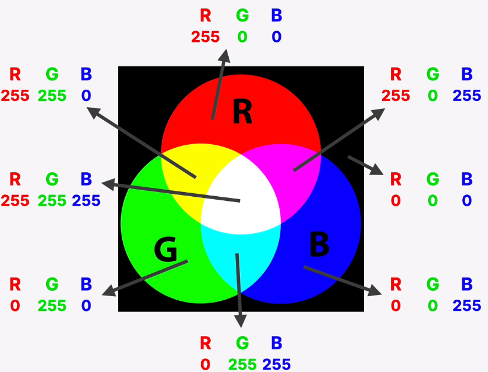

# Html & CSS

by Ing. Giovanni Frison

---

## Front-End Development

With Front-end development we indicate the writing of html, css and js code that will be rendered by the browser: i.e. what we can see when we open a webpage. When querying the browser for a particular domain, the browser is sending a request to the web server that is hosting the webpage. The response is a collection of files (html, css, js and picture) that the browser will render for us. When this files are simply sent by the web server without modification, we have a `static website`. Nowadays, the vast majority of websites are dynamic, meaning that the webserver is communicating with some applications and databases to continuously update the webpage content. A whole field of development is devoted to handle all this actions and it is called `back-end` development. Common back-end languages are node.js, php, python etc.

Coming back to the topic, the tree languages responsible for the front-end have different tasks:

* `html` is responsible for the content of the page
* `css` is responsible for the presentation of the content, i.e. its styling
* `javascript` is the programming language of the front-end responsible for the dynamic and the responsive effects. It can also be used to load data from webserver and create entire webpages called web applications.

---

# What is HTML

HTML is a markup language (not a programming language) and stands for Hyper Text Markup Language and it is the standard for creating webpages. It is a composition of elements that are rendered by the browser.
Following a basic html example:

```html
<!DOCTYPE html>             <!--it says this is an html5 document, and this is a comment-->
<html>                      <!--'html' is the root of the html page-->
<head>                      <!--'head' contains metadata about the page-->
<title>Page Title</title>   <!--being in the head section, it wont be rendered, but it will be the name in the page tab-->
</head>                     <!--'/head' indicates the end of the head section-->
<body>                      <!--'body' is the body of the page, where almost everything is displayed-->

<h1>My First Heading</h1>   <!--'h1' the element for the biggest heading format-->
<p>My first paragraph.</p>  <!--'p' is the element for paragraph-->

</body>
</html>
```

An html element is everything from the opening to the closing tag (es. `<p>...<\p>`). Some elements have no content like `<br>` (line break) and none of them is rendered by the browser, only their content.


## Semantic Html
With **Semantic** Html we basically mean the use of html elements not only to give a proper render in the browser but to create a more clear and informative structure/meaning to the html code. **We use semantic html to give a clear meaning to elements**. This concept came along with the introduction of Html5. For example we could use the `<div>` element as container in any situation, but it would be more semantically meaningful, e.g. for a navigation bar, to use a less generic and more specific `<nav>` element. 

Another reason to use semantic html is that search engine are able to "read the html structure" and better index the search.

Probably the most important reason is to give full `accessibility` to the webpage content for blind people or anyone using a screen reader.

## Basics of Html

Following the anatomy of an html element:


### DOCTYPE

The DOCTYPE declaration helps the browser to better display the page, it has to be declared only once at the top of the page and is not case sensitive. For html5 the declaration is `<!DOCTYPE html>`

### Head & Body

`<head>` and `<body>`, together with DOCTYPE, are the other fundamental part of an html code. The head contains  metadata about the page and its content is not rendered by the browser; The body instead contains everything that is rendered: headings, paragraphs, images etc..

### Heading

Headings tag goes from `<h1>` to `<h6>` in decreasing order of importance/size. Search engines use headings to structure the website content and as a consequence users can be more or less attracted by the weblink. Heading shouldn't be used to make a text bigger or smaller since they have a specific purpose in the page structure. Headers have a predefined font size but this can be override with the `style="font-size:60px";` attribute (font-size is a CSS attribute).

### Paragraph

Paragraph are tagged with `<p>`; they start always on a new line and have a predefined margin above and below. The browser is in control of the spacing, since it has to handle different window size and resolutions, therefore, adding extra spaces between words is useless, they will be stripped away. `<hr>`indicates a line break between two paragraph and it is rendered with an horizontal ruler, while `<br>` is a simple line break and can be placed also inside a single paragraph. If we want to preserve spaces and line breaks as they are written we can use the `<pre>` tag which usually comes with a default Courier font.

### Links

Links are defined by the tag `<a>`, the url of the link is indicated by the `href=` keyword, optionally followed by a string that will be clickable to redirect to the url. N.B. urls can have a absolute or a relative path; absolute path are discouraged since they refers to other webpages that can have copyright or modify the image in the long run, while relative path are relative to the website domain and therefore permanent.

```html
<a href="www.google.it">Go to google page<\a>
```

### Images

To render images the tag is `` and it has three arguments, `src` the source of the image, `alt` an optional alternative text, `width` and `<height>`- Img elements don't require any content (there is no closing tag), instead an attribute, i.e. a piece of data, can be inserted inside the tag; src (source) is the attribute that specify the path and the filename of the image to show.

Another important attribute is `alt` (alternative text) i.e. a description of the image. This is important for two reasons, the first is related to the ability of web search engine to associate the image to a specific search, the second is to allow blind people to let the web reader tell them what the image is about. The alt description won't be printed to the screen unless the image itself cannot be found, in which case the alt text will substitute the image.

```html

```

### Attributes

Everything inside the tag is referred as an attribute (es. src, width, height etc..). Some other useful attributes are:

* `<p style="colore: red">` style serves to specify attribute on text, like the color, fontsize etc..
* `<html lang="en-US">` lang serves to help the search engines to identify the language of the webpage
* `<p title="I'm a tooltip">` title creates a tooltip that appear when the mouse is positioned on the element

Here can be found a complete set of the attributes https://www.w3schools.com/tags/ref_attributes.asp

### Html entities
Html entities are printable special characters defined by a special html code. A complete list can be found here https://www.freeformatter.com/html-entities.html.


### Text Style

Text appearance can be altered with specific tags:

* `<strong>` for bold text (former `<b>` but wasn't semantic html)
* `<em>` for italic text (former `<i>`)


### Lists

Lists can be defined as `Ordered` or `Unordered`.
Ordered lists are enclosed in the `<ol>` tag and each element is numbered progressively with the `<li>` tag.
Unordered lists are enclosed in the `<ul>` tag each element is essentially a bullet point with the same `<li>` tag.

### Hyperlinks

Links can be divided into two major categories: the ones pointing inside the website domain (i.e. to another page of the same website) or the ones that point another external website. The structure of the tags is the same for the two typologies. We start with a `<a>` tag (anchor) and inside the tags we specify the text that wil be displayed on the webpage that will have the hyperlink attached. The actual url of the page will be an attribute inside the opening tag called `href`. Another attribute we may want to specify is the `target=_blank` meaning that the link will be opened in a new tab. For an internal link, instead of the complete url path we can simply place in the href attribute the name of the .html file at which we are pointing at. Finally, if we want to create a dummy link that doesn't point anywhere, we can specify `href="#"`, in this way, we can click the link but the only behavior we will observe is to go back to the top of the current page we are already on.


## Structuring the webpage

If we place elements in the body of the webpage without any particular structure, they will be simply placed one below the other. Instead, there are specific html5 elements that should be used to structure specific parts of the page. 

For example, if we have a series of hyperlinks at the top of the page we want them to be grouped in a `<nav>` (navigation bar) element. The appearance of the page won't change, we have simply grouped a series of link inside an invisible box, but when we will be adding a layout to the page it will be fundamental to have such structure.

Again, the top part of the page, i.e. the title and the nav-bar can be placed inside another html element called `<header>` indicating the top part of the page.

If it is a blog page, another common element for the actual content part is the `<article>` element. The article element itself can and should have an header element inside to better structure the content.

At the end of the body element usually there is a `<footer>`.

All of these elements serves for two purpose mainly: the first, as already stated, to later attach the elements to a layout and the second to give a semantic structure to the page.

---

# What is CSS

CCS stands for **C**ascading **S**tyle **S**heets and it is used to give a visual style and presentation to the content written in HTML. Basically CSS is a collection of properties used to format the webpage content. The basic element of CSS styling is a `CSS Rule` that is composed by:

* `selector`: the HTML element we want to style
* `declaration block`: a set of property-value pairs called
* `declaration`: composed of a property and its value


## Where to insert CSS code? 

CSS code can be placed in 3 different places: 

* `inline` means that we are going to add a `style="property: vale;"` directly inside an HTML element (`h1` for example) and this is to be avoided because in this way we need to style each element singularly

* `internal` means that we are going to create a `style` block inside the `<head>` of the HTML file, and there we will write our css rule that will effect the corresponding elements in the file; this is already a better strategy since it fullfil the *separation of intent* (each part of the code has its own scope, do not mix up html and css), but if the css part becomes important, then the file will be messy and difficult to read. Therefore the best strategy is to place our css code in a separate file

* `external` is the best strategy, meaning that we will have all the css code in an external file (e.g. `style.css`). Now, the css and html file needs to be linked and this is done trough the `<link>` element, also placed in the `<head>` block.

```html
<link href="style.css" rel="stylesheet" />
```

## Commenting css code
To comment css code the syntax is to embrace what we want to comment inside `/* ... */` (Ctrl + / in VsCode)

## Combining selectors

Many selector may share the same property, like the font-style for example, therefore it is better to group the selectors and assign that property in one place so that if later on we need to change it it will be mush easier:

```css
h1, h2, h3, p { font-family: sans-serif;}
```

Another way in which is useful to combine selector is one there is a parent and a children, called `descendent selector`: let's imagine we have a `footer` with a `p` inside adn that we have specified a style for all the paragraph; however the text inside the footer should be smaller, therefore we can combine the selctor to specify how a paragraph should behave when children of a footer:

```css
footer p {font-size: 16px}
```
Now all the `p` inside the footers will have those properties. This works but we are somehow embedding the html structure inside th css file and this can cause problems later on if the structure of the webpage changes.

## Classes and ID

Instead of using descendent selectors which are bounded to the html structure, the best way to customize our elements is to give them a name and an id in order to be able to refer to them directly. Both the properties `id` and `class` can be inserted in the opening tag of an html element; the fundamental difference is tha `id` must be unique while `class` can be reused in more than one element. To refer to ids an classes in the css file:

```css
#id_name {some-property: some_value}
.class_name {some-property: some_value}
```

Generally, it is better to use classes since we never know in the future what is gonna change and it might be useful to add the same style to new elements we add later; styling with id we would have to repeat the style or change the id to class.

## Pseudo-classes

Another way to act systematically on html elements is to work with `pseudo-classes`. With these we can refer to elements that are in the same relative position to a parent or a child element. Let's imagine that we have multiple lists in our webpages and we want to have the first element always in bold text; we could create a custom class for all the first `<li>` elements but the best approach it to refer relatively to any first `<li>` element:

```css
li:first-child { font-weight: bold }
/* if we want to specify a specific child number instead, lets say the third;
we can specify also keywords like 'odd' for style only the odd li elements */
li:nth-child(3) { font-weight: bold }
```

## Styling text

When styling text we will refer to the selectors that ofc contain text like `h1`, `p` etc.. If we give a style to a particular element, then whenever it appear in the html it will be styled in the specified way together with all the other elements that it contains (imagine a paragraph `p` that has inside a link or a list).

Following some of the most common property we may wan tto specify while styling text:

* `font-size`: size of the font, default is `16px`
* `font-family:` the type of font; we cant use an arbitrary font because the user may not have that font installed and therefore won't be able to render in the way we intended. For now, the safe keyword we want to specify in order to have the browser take care of the font is `sans-serif`
* `text-transform`: e.g. uppercase, capitalize etc..
* `font-style`: e.g. italic, bold etc..
* `line-height`: text interline, it is an integer that multiply the height of the text.

## Colors

There are different ways to express colors in code depending on the standard we are using. 

The most common is probably the `RGB` model, where every color can be represented as a combination of `red, green and blue` in a scale from `0-255` for a total combination of more than 16M colors:



In css, we have two way to specify an rgb color: using the `rgba notation` which is a function that takes 4 argument where the fourth is the transparency (alpha); using the `hexidecimal notation`, a string composed by an # follow by 6 characters that goes in couple from 0 to f (if one couple has the same value we can leave just one of the two). In hexadecimal, the transparency is given by two additional characters going from `ff` (alpha=1) to `00` (alpha=0) 

```css
rgba(0, 255, 255, 0.5)
#00ffff or #0ff
```

A special case is the grey color which is obtained with the 3 colors at the same values, leaving us with a choice of 256 shades of grey.

We can also color the background of our html elements using the `background-color` property. Instead, if we want to style the color off all the webpage we could apply the background color directly to the `body` element.

## Styling Hyperlinks

To style links, we might think to apply the css property directly to the `<a>` anchor element, but this is not the best practice; instead we should use pseudo-classes where we can actually specify which anchor elements to target, in this case the ones containing an `href`.

```css
a:link {color: #ff00ff}
a:visited {color: #ff0} /* change behavior if we have already visited the link */
a:hover {color: #fff}  /* change behavior if we pass on it with the mouse */
a:active {background-color: #000}  /* change behavior if we click with the mouse */
```

Now we are specifically targeting those anchor which has a link inside. There are other common property that we can specify:

* `text-decoration: none` to remove the underline
