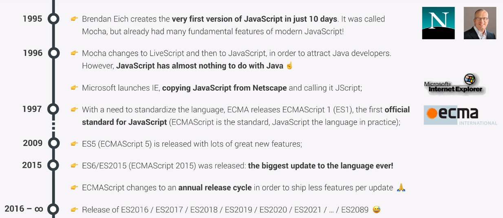
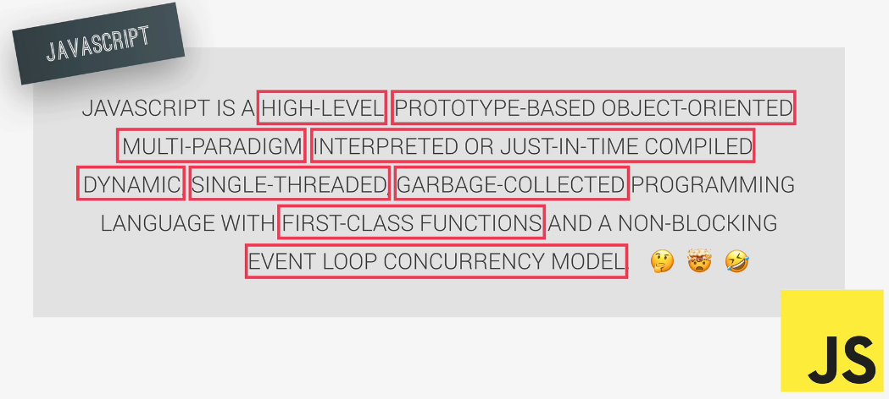
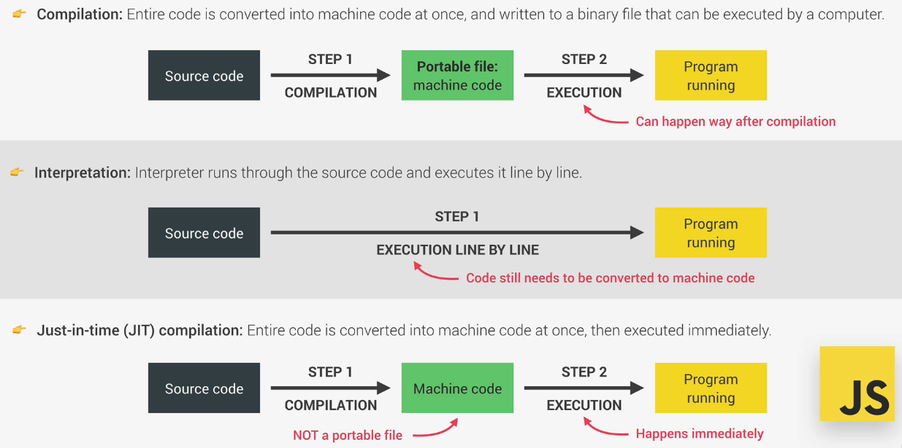
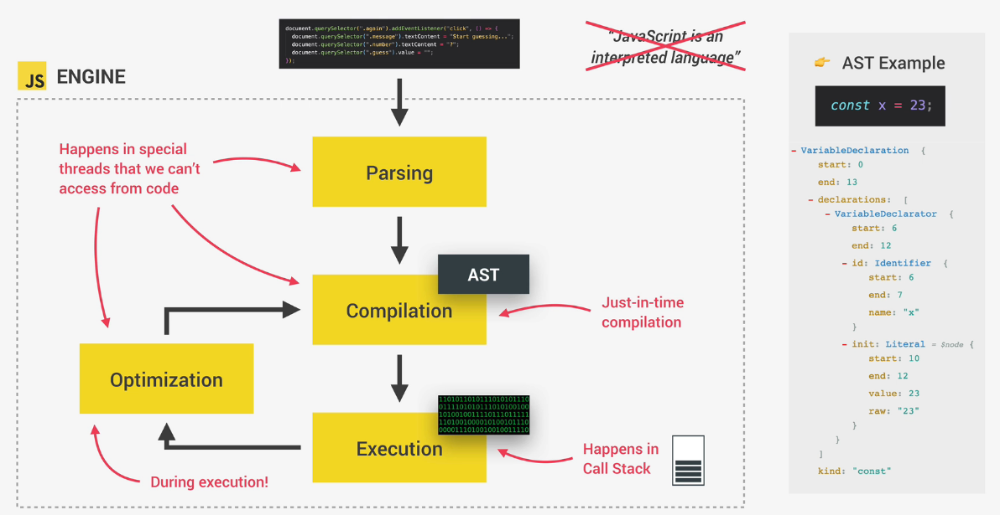
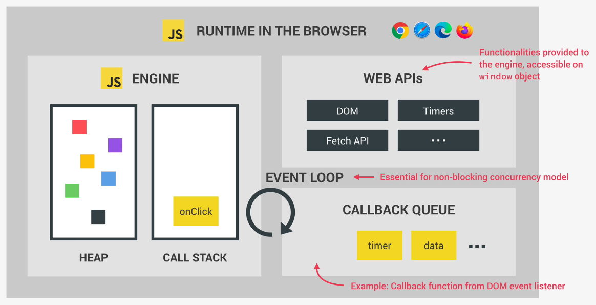
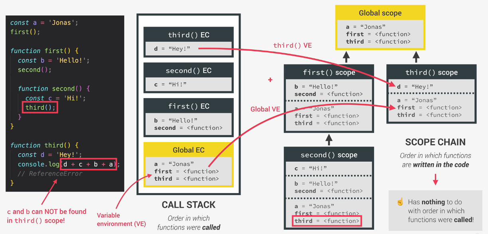
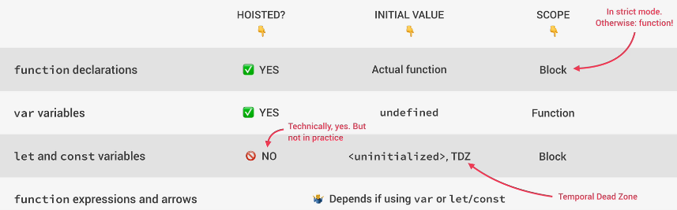
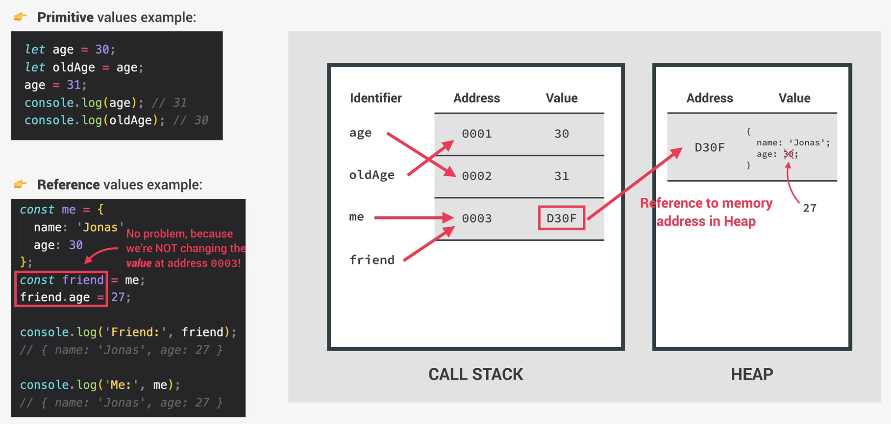
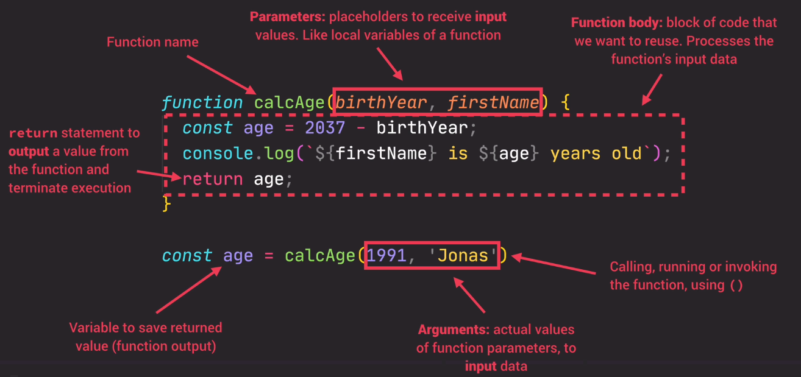

# Javascript Manual

---

Javascript is an high-level, object-oriented, multi-paradigm programming language. In web development, while htm and css are responsible for the content and the styling of the webpage, js is responsible for handling its dynamic and user interaction, to load data, e.g. from databases, to manipulate html and css content and so on. Frameworks like React, Angular and Vue.js are tools that enhance the creation of webpages and are 100% based on js. In the same way we can use js also outside the browser, on web server, to build back-end services with framework like node.js.

## JS release

Starting from 2015, with the release of ES6 (ECMAScript) we talk about modern javascript, and since then an annual release has been done with some new features.



An important dogma of the js release is **`DON'T BREAK THE WEB!`** which traduces is a full backward compatibility of modern js engine withe older version up to ES1 (1997).

However Js is not forward compatible, i.e. older version of the browser may not be able to understand what will come next in modern or future js. For these reason is good practice to develope with the aid of the latest release of google chrome and, in production try to translate (`transpile and polyfill`) the same code in ES5 (fully supported from 2011) with tools like `Babel` to ensure compatibility with all browsers.

To have an understand of what is compatible in ES6 we can check <https://kangax.github.io/compat-table/es6/>

## Run JS code

JS code needs always to be related to an html file. We can directly code inside the html file under the `<script>` tag. We can watch what we have executed using the webpage inspector under the `console` tag only if we have redirected the output to the console itself using the command `console.log(my_var)`. However, what is done in practice is to create a separate `script.js` file that will contain the js instruction and will be loaded inside the html file. The connection between html and js is usually done at the bottom of the body part as:

```js
<script src="script.js"><script>
```

## Styling rules

* commands must be ended with semicolon `;`
* variables are written in camelCase style
* variables cannot start with numbers, and can contains only number, letters, dollar sign and underscore
* variables cannot use reserved keyword like *new* or *function*
* variables shouldn't start with upper case letter (uppercase are related to class)
* constant are written in uppercase
* use descriptive variable even if a bit longer

### Comments

Simple comments are done with the `//` while multi-line comments are done with `/* ... */`. In vs code multi-line comment are performed with `Ctrl + Shift + A` (`Alt + Shift + A` on windows).

## Strict mode

For security reasons of our code we should always place, as the absolute first line of our code, the following line:

`'use strict'`;

This line activates the `strict mode` that forbid us to do certain errors and create visible errors where usually we may encounter a silent failure. Moreover, it reserves some words to core js construct/functions so that can't be used as variables name, avoiding possible conflicts.

---

# JS Deep Dive



The above image shows a dummy but full definition of what js is together with most of its feature. Let's analyze them:

* `High-level`: an high-level programming language (like python) takes care of the hardware resources (RAM and CPU) that needs to run or simply create a variable thanks to a process called `abstraction`. This makes it much more user friendly (to learn and to use) and ready-to-use compared to a low-level programming language like C or Java, that need a manual resources allocation, but **never as fast and optimize**.
* `Garbage-collected`: hand-to-hand with high level definition, the garbage collector is essentially an algorithm that is able to determine when to remove un'used variables in order to free hardware resources.
* `Interpreted or just-in-time compiled`: The conversion to machine language (series 0 and 1) happen at compilation time inside the **js engine**

  

* `Multi-paradigm`: can follow different approach of structuring the code (e.g. OOP or FP)
* `Prototype-based object-oriented`: like python, everything is an object and most of the built-ins (like tha array structure) is based on a blueprint that gives functionality to the new instances (class-instance relation in python).
* `First-class functions`: functions are treated as variable, can be passed or return into other functions (allows the use of functional programming FP)
* `Dynamic`: dynamically typed, contrary to statically typed, variables have not datatype definition and can be changed at runtime (**TypeScript** is the statically typed version of js)
* `Single threaded`: like python, js can't natively compute in parallel
* `Non-blocking event loop`: long task can be executed in background and putted back in main thread once they are finished, so that the program execution won't be freezed.

## The js Engine

A js Engine is essentially a program that execute js code; every browser is shipped with a version of it but the best known is `V8 Engine` that powers chrome and node js (the server side version of js).

The js engine is composed of two part:  the `call stack` where the code is executed and the `heap` where the object are stored in memory. As explained above, js use JIT compilation to be more efficient in the execution of a task; this process start with the js engine parsing the code (reading the code) creating the `AST Abstract Syntax Tree`, i.e. the subdivision of the const or function keyword in a structured way, in this step **syntax error** are also checked. The second step is the compilation of the AST in machine code that finally get executed right away (execution happens in the **call stack**). In reality, the process in not linear, to speed the execution, the compiler create at first a very raw version of machine code from the AST in order to be able to start the execution asap; then, during execution the compilation is optimized even more then once, until the executed machine code is at its best performance. All this happens in non-accessible threads external to the main thread that we can access during the execution of our program.



## The Execution Context

Imagine our program has just been compiled, therefore the execution begins. What happen at first is that a `global execution context` is created and al the top level code (e.g. constant and function name, but not function body) are stored in order to be used later one. There is always only one global execution context for each js program. Once the global EC is filled with the top level code, it gets executed and only after starts the execution of functions body. Each function or method calls creates its own `local execution context` containing the information to run the function itself and this will be stacked in the **call stack**. When all the function are executed the call back will wait for any event callback (e.g. click event), thanks to the **event loop**, to actually perform the actions coded in the function.

So now it clear what is the utility of an execution context, but what it is made of? First, we have a `Variable Environment`, i.e. the declared variable (const, var, let), the functions names and their *arguments object* (all the arguments passed to the functions). Next we have the `Scope chain`, essentially a set of references to variables that are located outside the current functions scope. Finally, each context contains the `this` keyword (we will see later what is its purpose). The creation of this part of the EC happens at `creation phase` right before the real execution phase.

**N.B. [arrow functions](Arrow-functions) have a different EC, in fact no *arguments* are inserted in the variable environment and the *this* keyword is not present**

Once the Global and all the local EC are created how does the js engine knows the order of execution or where it currently is while executing? Here comes the **call stack**, the place where execution context are stacked on top of each other; once a context is executed, it gets removed from the stack. Of course, the first to be inserted in the stack is the global scope, but as soon as a function gets called, the function scope is created and stacked in order to be able to execute its body and so on (e.g. if inside the current function there is another function call, then the scope of the second function is immediately created and stacked, and the execution is switched to the second function context); once the current function is terminated it gets removed from the stack and collected by the garbage collector, and the js engine can easily retrieve where to continue the execution simply looking at the stack to the element before the one removed.

## The js runtime

The `js engine` alone is not sufficient, in fact we need also the `WEB APIs` to interact with, basically the tools to interact with the engine that are not part of the engine itself. The js engine, together with the web APIs and the `callback queue` (a data structure that contains all the callback function, like the *event handler* that we use to interact with the DOM) composed the so called `Runtime`. What happens essentially is that the command in the callback queue are unstacked and send to the js engine call stack (when it is free from the code being executed); this happen thanks to the `event loop` that does this transfer from callback queue to call stack, taking care of non-blocking the execution therefore handling concurrent event.



The difference when talking about `node js` is that being on the server side, we are not talking to the browser, therefore we are not interacting with the web APIs but with **c++ bindings & thread pool**

## Scoping and scope in js

We have seen how execution context are created an that contain the *variable environment*, *the **this** keyword* and the `scope chain`. But what it is a Scope and what kind of scope we have in js? The scope is essentially the part of the code in which a variable live and from which it can be referenced. Like in python, we have the concept of `lexical scoping`, i.e. the scope is controlled by the code structure, or in other words by the placement of function and blocks in the code (e.g. a function inside another function can access also the scope of the parent function).

We have three different scope in js:

* `global scope`: is the scope of the top level code, i.e. all the variables that are defined outside a function or a block; what is inside the global scope is accessible from everywhere in the code.
* `function scope`: also called **local scope**, each function create its own context and its own scope; here lives variable that are accessible only withing the function
* `block scope`: starting with ES6 we have also the definition of a block scope, i.e. everything inside curly braces  (e.g. the logic inside an if statement) except for **object literal** (the way we define an object with properties in js); like the local scope of functions, whats inside the block scope  lives only in the block scope, but this applies only to **let** and **const** variables (if we use **var** instead, this wil be accessible from the global scope). N.B. in *strict mode* functions are block scoped.

### The Scope Chain

Since we have all this different scope that can be easily nested one within the other, it is important to understand the concept of `scope chain`. Basically, a local scope can always get variables from its outer scope, but not the opposite. Therefore, a function within a function, will have its own private local scope, but it will be able to access to the scope of the parent function and also to the global scope. This process is called `variable lookup`; before trowing an error, the js engine will look to all the parents scope up to the global scope to check if a certain variable exist. Out of scope variables are not copied but simply referenced. To stress out the concept, two functions that are siblings, i.e. lives in the same scope at the same level, won't share their scope, therefore win't be able to reference the variables defined inside the other.

### Scope chain vs Call stack

The scope chian and the call stack ares related but have a fundamental difference. While the scope chain is based on the lexical scoping, i.e. the order in which function are written and nested within each other, it has nothing to do with the order in which function are called and stacked inside the call stack

Following, an example of the relation between scope chain and call stack. In particular, looking at the function *third* we can see how it tries to access  **c** and **b** that are outside its scope chain, therefore js will thrown an error.



## Hoisting

Before execution, in the so called `creation phase`, the code is scanned for variables declarations, and for each of these a property is created in the `variable environment`, one of the component of the **execution context** as we have seen. The result of this process is called `Hoisting` and it makes some variables accessible ans usable in the code before they are actually defined. The image below summarize the behavior of variable in js: `var` variables (don't use them!) are source of bugs also because they are hoisted, but their initial value is **undefined** (therefore, if we try to call them before their actual declaration, we do not get the actual value we have assigned but *undefined*); `let` and `const` variable instead are not hoisted and therefore they can't be accessed before their actual declaration (it is said that they leave in the **TDZ** **T**emporal **D**ead, **Z**one). Again, we can use function declaration before they are actually defined in the code, but we can't do it with function expression or arrow functions.



The `windows` is the global object in the browser console that holds the some types of variables, like the **vars** or the **arrow functions** because these creates property on the windows object itself.

### The TDZ Temporal Dead Zone

As we have seen, the **TDZ** is a place where variable are stored before they are actually declared in the code, meaning the the js engine knows about their existence but won't be bale to return their value before they are actually reached in the code structure. However, we get different error for an undefined variable (a variable that is referenced that actually is never declared in the code) or a variable in the TDZ. The former returns a:

* `ReferenceError: x is not defined`

The latter instead (the one in the TDZ):

* `ReferenceError: cannot access 'x' before initialization`

## The `this` keyword

*Very close to the `self` in python*

Along with the *variable environment* and the *scope chain*, the **this** keyword is a special variable created for each execution context (i.e. also for every function).

The value of **this** `is not static` but depends on the way of a function is called. For example, in a method (a function defined as property of an object) **this** is referred to the object in which the method is contained:

```js
const me = {
  name: 'Giovanni',
  year: 1989,
  calcAge: function() {return 2022 - this.year};
}
```

In the example above, `calcAge` is a method for the object `me` and in this situation **this** is actually a placeholder for the object name (this === me).

N.B. the method doesn't need to be coded inside the object, it just need to be called by the object:

```js
const me = {
  name: 'Giovanni',
  year: 1989,
}

const calcAge: function() {return 2022 - this.year};

me.funcToCalcAge = calcAge;

me.funcToCalcAge() 
```

As long as the object has the property **year** requested by the function, it will work, and **this** will point to the object name.

* For **simple function** call, **this** will be equal to **undefined** (in strict mode only!); with *simple* we mean a function that has not an owner, i.e. is not attached to any object. This happens also if we perform a function call inside another function, so be aware! A solution could be to declare a variable in the function outer scope (usually called **self**) to store the outer value of **this**:

```js
const someFunc = function () {
  variable: 0000;
  const self = this;
  const innerFunc = function () {
    console.log(self.variable)
  };
  innerFunc()
};
```

Normally, the output of the *console.log* would be **undefined** since **innerFunc()** is a *simple* function call; however, since we have stored into **self** the value that **this** has outside **innerFunc**, we solved the problem.

The second solution is to use an arrow function instead of **innerFunc**, since it natively has not a **this** variable defined and it will fall back to the outer scope, i.e. the **this** of **someFunc**.

* For **arrow function**, since we have seen that they don't have an execution context, the **this** variable is not defined and it will fall back to the surrounding execution context. It is also called `lexical this` since it is picked from the outer (respect to the arrow function) lexical scope. **Never use an arrow function as method!**
  
* If the function is called by an **event listener** trough the DOM, then **this** will refer to the DOM element to which the function is attached.

* Finally, if we try to access **this** from the global context, we get the **window** object of the browser. N.B. the same will happen if we call **this** inside an arrow function that lives in the global scope!

## Primitives and Objects

Like in Python memory addresses and variable names pointers, also in js (since it is also a dynamic programming language) there are some caveat to be aware of.

Let's first define the difference between **primitives** and **objects**:

* `primitives` are the set of types that we can use in js (Number, String, Boolean, Undefined, Null, Symbol adn BigInt) and are store in the **call stack** of the js engine, or more precisely in the execution context of the block in which are declared.
* `objects` are **reference types** (Object literal, Arrays, Functions etc..) and are store in the **heap** of the js engine

When working with `primitives`, what might happen is the follow:

```js
let age = 30;
let oldAge = age;
age = 31;
console.log(age); // 31
console.log(oldAge); // 30
```

When we create the variable age, in the call stack an identifier is created for that name and this point to a memory address that stores its value (30). Then, when we declare `oldAge = age`, we are creating a new identifier in the call stack that points to the same memory address of `age`. Finally we redefine the value of `age` to be 31, but the value associated with the first memory address is immutable, therefore a new address is created with the stored value of 31 and the variable `age` now points to it while `oldAge` still points to the first address with the stored value of 30

When working with `object` it works different because these can be too large to be contained directly in the call stack. As a matter of fact, when an object is created, its memory address, together with its value, is stored in the **heap**; instead, in the call stack the only thing that is store id the object name, its address and as value **the address stored in the heap**, i.e. a reference to the memory address in the heap (this is why objects in this context are also called **reference types**).

Now the big difference with primitives is when we create a new variable and we set it equal to the object. In this case, a new identifier is created in the call stack, which point to the same address of the first object, therefore sharing also the same memory reference to the heap. Now if any of the properties of the two object get changed, also its value stored in the heap address change, and since both the variable points to the same address, both get changed. **N.B. this is valid even if the variables are defined as const!**, this because the values in the call stack doesn't get changed, only the values stored in the heap.



### Copying an object

*Same concept of shallow and deep copy in python*

So, how do we really create an independent? One way it to use the function `Object.assign()` which takes two arguments, the first is the receiver and the second is the object to be copied. Therefore, if we set as a receiver an empty object, we get as a result a new independent object with the same properties:

```js
const realCopy = Object.assign({}, objectToBeCopied);
```

Object assign creates a `shallow copy` of the object, meaning that only the first level of recursion is copied and therefore, the inner data structure share still the same reference to the original object (e.g. the values of an array inside an object).

To achieve a `deepcopy` in js is not trivial (as is not in python, we use the copy.deepcopy module) and it needs third party library.

---

# Functional Programming

Functional programming is a programming style that is based upon breaking up our code in to verbs (in contrast with OOP that is based on nouns). The idea is to do pure function that have few side effects and are easier to test (even if pure functional is not possible in particular if working with web when there are inputs and outputs from outside the code).

---

# Values and Variable

Values are basically the smallest unit of information that we have in js; these can be stored in variable with the assignation symbol `=`. To declare a variable we simply:

```js
let firstName = "Giovanni";
```

*firstname* is now a variable that stores a string and can be later be manipulated or printed to console. `let` has to be used only the first time we declare a variable, if we want to reassign a value to an existing variable we don't need it.

N.B. we can declare more than one variable at the time and also leave it without assignment (e.g. `let x, y;`)

## Variable declaration

We have seen that to declare a variable the first time we use the keyword `let`, while to mutate its content we can simply call the variable name. There are other methods from ES6 to declare variables that are more expressive:

* `const` is used to declare variable that cannot mutate; for this reason, it is not possible to declare empty const variable. If we declare an object as const, i.e. an array, the properties inside of it are still mutable but the variable assigned to const can't be reassigned. To render immutable also the inside of a const object we can use the method `Object.freeze(myObject)`

* `var` is the prior ES6 declaration, `not to be used anymore!`

As a best practice, it is better to always use `const` to declare a variable unless we are really sure it should be changed along the script. We want to have the minimum amount of mutable variable in the code since these can be source of bug.

We can potentially use a variable without using any of these constructors and it will work just fine, but it is a terrible idea since it want have a reference in the local scope of the script!

---

# Datatype

Like python, js is a dynamically typed programming language, meaning that the type of data passed to a variable is not declared but directly inferred by js and, in general, can be changed at any time. It is the value that as ah inherent type, not the variable.

There are several type of datatype in js. but first of all lets distinguish between `object` and `primitive`.

`Primitive` are:

* numbers, by default floats
* string
* boolean
* Undefined, a variable that has been declared but not assigned
* Null, another empty value (n.b. for legacy reasons, *typeof null* will return *object*)
* Symbol, a value that is unique and cannot be changed
* BigInt (from ES2020), a larger integer, too large for the number type

## Checking types

We can inspect the type of a value or a variable by using the operator `typeof`

```js
console.log(typeof true);
// output: boolean
```

## Type conversion and coercion

`Conversion` is the voluntary action of change one variable from a datatype to another, while `Coercion` is an undeclared change in datatype carried out by js in particular situations. An example of `Coercion` is when printing a concatenation of string and numbers; the concatenation will automatically convert the number in string behind the scene. The opposite happen when concatenating with the `-` numbers in string format; in this case js will convert strings into numbers.

```js
// type coercion
console.log('10' + 3) // return 103
console.log('10' - 3) // return 7
```

Example of `Conversion` are those functions like:

* `Number(arg)` -> return NaN if arg cannot be converted
* `String(arg)`
* `Boolean(arg)` -> evaluate the truth values of a variable

## Truthiness of a value

The truth value of a variable is the boolean representation of that value `Boolean(arg)`. By default all the values evaluate tu `true` except for:

* `0`
* `''` -> empty string
* `undefined` -> e.g. asking for a key that doesn't exist in an object (dictionary)
* `null`
* `NaN`

---

# Basic Operator

Basic operations are performed in a similar manner in every high level programming language at least similar to python for what I know). For a complete list of `operator precedence` see <https://developer.mozilla.org/en-US/docs/Web/JavaScript/Reference/Operators/Operator_Precedence>; most operation are carried out left-to-right but some others, like assignment or exponential are applied right to left, meaning that the lest part of the expression is first evaluated and the assigned to the right part (same in python)·

## Mathematical

* `+` is summation and string concatenation
* `-` is subtraction
* `*` is multiplication
* `/` is division
* `%` is mod operator
* `**` is power elevation

## Assignment

Operator that assign or reassign values to variables

* `=` assign a variable to a value e.g. `x = 10`
* `+= or -= or *= or /=` in line operation on the variable
* `++ or --` increase/decrease the variable by 1

## Comparison

Comparison operator works as expected, producing a boolean value in output.

* `>, <, >=, <=` are the comparison operator

## Logical

Logical operators relative to boolean mathematics are:

* AND -> `&&`
* OR -> `||`
* not var -> `!`var

N.B. the 'not' operator `!` has precedence on `&&` and `||`

## Equality operator

We have two type of equality operators: `===` that check a strict equality, meaning that no coercion is carried out, and `==` , the loose equality operator that evaluate to true even if a coercive conversion has to be carried out by js:

```js
18 === 18 // true
'18' === 18 // false
'18' == 18 // true
```

The loose equality operator can introduce strange behavior in our code, therefore only use it if it strictly necessary.

Similarly we have the inequality, strict and loose, which are defined as `!==` and `!=`.

---

# Strings

Strings are very important primitives types. They can be concatenated with the `+` sign, and js will automatically convert the type to a string if possible, or in a cleaner way (from ES6) with `strings template` (basically python f-string).

```js
const name = 'Giovanni';
const stringTemplate = `My name is ${name}!`; // `` back ticks required
```

In the same way, the back ticks format of writing strings is very useful to write multi-line strings simply returning each new line.

```js
const multiLineString = `This is a
                        multi-line
                        string`
```

## Sum of numbers as string

To sum two number of type string, instead of convert them with the `Number()` function, we can use `unary operation`; basically, the operator `+` and `-`, placed in front of a string will convert it to a number. hterefore to add two strings we can simply:

```js
const sum = +numberAsString1 + +numberAsString2;
```

---

# if, else control structure

The `if / else` code block si defined as `control structure` and is composed by:

```
if (condition) {
        executed if true;
    } else {
        executed if false;
    }
```

Everything that is defined inside the control structure exist only there, therefore, we cannot use a variable that is defined/created inside the if/else block outside of the block itself. We have first to define the variable outside the structure to be able to access it again after it has been modified by the if/else.

```js
const name = 'Giovanni';
const age = 19;

if (age >= 18) {
    console.log(`${name} can drive a car!`);
} else {
    const yearsLeft = 18 - age;
    console.log(`${name} isn't old enough to drive!
He will be in ${yearsLeft} years`);
}
```

When the if statement is only one line (it test only the *true* scenario) we can omit the `{}`:

```js
const age = 18
if (age === 18) console.log('You are now an adult!');
```

## else if

We can concatenate more than one if condition with the `else if` constructor (`elif` in python):

```js
let dummy = 1;
if (dummy === 1) {
    console.log("exactly 1!")
} else if (dummy > 1) {
    console.log("greater than 1!")
} else {
    console.log("less then 1!")
}
```

## The Switch statement

An alternative to multiple *if - else if* block is to use a `switch statement`. Coming from python, it is essentially a dictionary which contains a series of key-action pairs. The comparison between the keys and the test value is a strict comparison `===`.
The `break` keyword is needed after each key in order to stop the execution, otherwise js will execute everything up to the first `break`. Two cases that follows up without a break have the same logic of an `OR` statement.

```js
const pickANum = prompt("Please choose a number");

switch (pickANum) {
  case "1":
    console.log("you picked 1");
    break;
  case "2":
  case "3":
    console.log("You picked a number between 2 and 3");
    break;
  default:
    console.log(`You picked ${pickANum}`);
}
```

## The Conditional operator

Another way to use the if-else statement in more compress way is the `Conditional operator` also called `Ternary operator` since it is composed by 3 parts: first we have a statement, followed by a question mark `?`, followed by the `true` condition, followed by semicolon `:` and at last by the `false condition`.

```js
const age 20;
age >= 18 ? console.log('You are an adult'): console.log('You are a child')
```

In a more realistic scenario we use it to conditionally store a variable:

```js
const age = 20;
const whoAreYou = age >= 18 ? 'Adult' : 'Child'
// instead of
let whoAreYou;
if (age >= 18) {
  whoAreYou = "Adult";
} else {
  whoAreYou = "Child";
}
```

In this way we are storing a value in the variable status based on a ternary operator.

Ternary operator are useful also in string templates since we can insert any expression inside the `${}`.

---

# Loops

Together with if/else, loops are the fundamentals control structure of every programming language.

## For loop

In js, the for loop is structure in the following way:

```js
for(let i = 1; i <=10; i++) {console.log(`Repetition number ${i}`)};
```

So, we have 3 parameters: the first one is the declaration of the lopping variable `let i =1`, the second is the stopping criteria, i.e. stops when `i = 10`, and this gets evaluated at each loop until it return `false`, the third is the incremental step, in this case we are adding 1 to `i` at each iteration.

A common operation is to loop on arrays to retrieve or create elements:

```js
const square = [];
const integers = [0, 1, 2, 3];
for (let i = 0; i < integers.length; i++) {
  console.log(integers[i]);
  square[i] = i ** 2;
}
```

### Loop on elements

The classic method of looping is to use indices and then access an array element by position, however, from ES6 it is possible to loop directly on the elements of an array:

```js
for (item in array) {console.log(item)};
```

### Continue and break

We can elaborate even more the structure of the for loop be inserting `continue` and `brake` conditions; essentially we are going to test with an if/else statement the truthiness of an expression and if we add **continue** to it, if evaluated **true** it will skip the current iteration, while if we add **break** it will exit entirely from the loop:

```js
const square = [];
const integers = [0, 1, 2, 3, 4];
for (let i = 0; i < integers.length; i++) {
  console.log(i % 2);
  if (i % 2 != 0) continue;
  square.push(i ** 2);
}

console.log(integers, square);
```

### Looping backwards

In the same way we can loop backward on an array by simply switching the conditions, i.e the starting point of `i` will be the length of the array and the step values will be `-1` (i--):

```js
const integers = [0, 1, 2, 3];
for (let i = integers.length; i >= 0; i--) {console.log(integers[i])};
```

### Nested loops

Ofc, for loops can also be nested at multiple levels simply be nesting the same structure inside the loop body:

```js
for (let i = 0; i <= 3; i++) {
  for (let j = 0; j <= 3; j++) {
    console.log(i, j);
  }
}
```

### .forEach

`.forEach` is a contract way to perform a loop on an object. It is a method attached to an iterable object (like an array) and takes only one argument, the function to be passed to each element of the iterable.

```js
a = [1,2,3,4]
a.forEach(function(i) {console.log(i)})
a.forEach(i => console.log(i))
```

The `_.each()` method is more in the direction of functional programming because it doesn't rely on an object to be implemented.


## While loop

In the while loop we have only to specify the stopping condition, the declaration of the incrementing variable has to be outside the loop while its step towards the stopping condition has to happen inside the loop itself:

```js
let i = 0;
while (i<10) {
  console.log(i);
  i++;
}
```

The strength of a while loop is that it doesn't need a counter but only a condition to evaluate the decision of stopping or continuing running.

---

# Functions



## Function declaration

The constructor for functions ins js is the following:

```js
function function_name(what) {
  const whatIsIt = `This is the function ${what}`;
  return whatIsIt;
}

const whatIsIt = function_name("body");
// now we can use the variable 'sayIt' anywhere in the code
console.log(whatIsIt);
```

So, we have the keyword `function`, the name of the function with possible arguments passed inside the parenthesis, and the `function-body` inside the curly brackets.

To call the function we simply need to write the function name: `function_name();`, but if we want to use in the code the variable that is `return` inside the function, we need to store the function call into another variable. We call this way of defining a function `function declaration`.

Functions have also two special variables attached (only applies to regular function):

* `this` which is created inside the execution context (see [here](The-`this`-keyword))
* `arguments` which returns an iterator containing the argument of the function, all of those we pass in the function call, even if we specify more arguments than the prescribed one in the function definition.

## Anonymous functions (function expression)

Another way to declare a function is to directly assign it to a variable without giving it a name; in this way, when we want to call the function later on, we will directly call the variable in which we store it.

```js
const anonymous = function (arg) {return console.log(arg)};
anonymous();
```

This way of defining a function is called `function expression`

**N.B. The main practical difference between function declaration and function expression is that the former can be called in the code also before its definition.**

### Arrow functions

From ES6 there is a new, more compressed way to write function expression, that is arrow function (similar compression happen in the [conditional operator](#The-Conditional-operator) to replace the if/else statement).

```js
const arrow = (arg) => console.log(arg);
arrow("ciao");

const big_arrow = (arg1, arg2) => {
  const arg3 = arg1 + arg2;
  return arg3;
};
big_arrow(2, 4);
```

Essentially we don't need the curly braces (becaomes mandatory if we need to perform more than one operation inside the function), the keyword *function* and **the return is implicit** (if we have only one line of function, if the curly braces are needed, i.e. there is more than one line of coe, than the return has to be explicit).

---

## Built-in common functions

### prompt()

The js function to ask for user input is called `prompt`; it returns a string that can be stored in a variable.

```js
const pickANum = prompt("Please choose a number");
```

### Number()

Convert a compatible type to number

### Math

* `Math.random()`: returns a random float
  * `Math.random()*x`: returns a random float between 0 and x
* `Math.trunc(float)`: truncate a float into an int

---


# Objects

*coming from python objects == dictionary*

Everything that use a dot notation is an object

An object is a collection of **unordered** key-value pairs:

```js
const person = {firstName: 'Giovanni', lastName: 'Frison'};
person.firstName; // Giovanni
person['lastName']; // Frison
```


The difference in retrieving the value with the dot or the brackets notation is that inside the brackets we are able to write an expression that compose to a key value, and this can come handy in certain situations. Moreover, we can't use the dot notation if the key is not a string literal, eg. `person.0` is not valid but `person[0]` is.


```js
// a silly example
const key = 'Name';
person['last' + key]
```

We can use both the dot and the bracket notations to also add an entry to our object:

```js
person.birthYear = 1989;
person['isMarried'] = true;
```

We can insert also key-value pairs that holds functions and in this case they goes under the name of `methods` of the object:

```js
person.calcAge = (birthYear, presentYear) => presentYear - birthYear;  
```

When working on a function that is held by an object we may need to refer another property of the object itself. In the example above, the variable `birthYear` is already a property of the object `person` therefore it doesn't make sense to repeat it, both for the possibility of introducing error and the redundancy (not compliant with the `DRY` don't repeat yourself - principle). To avoid this we can refer to a property of the object holding the function `age` with the special keyword `this` (**N.B. it doesn't work with arrow function.. not sure but probably because of they are stored in memory**):

```js
person.calcAge = function (presentYear) {return presentYear - this.birthYear};
```

*We can think at `this` as the `self` used in python classes.*

This works, but we can think at a smarter way to do it, becaus right now we are computing the subtraction every time we call the function, but in reality, what is return by the function is clearly a new property of the object `person`. Therefore, a smarter way to proceed would be to store the *return* directly as a new property:

```js
person.calcAge = function (presentYear) {
  const this.age = presentYear - this.birthYear;
  return this.age // we could avoid the return at all};
```

Now, when the calcAge will be called the first time ti will append to the object `person` the property `age` avoiding us and the machine the burden to compte it over an over when requested.

---

# Arrays

*coming from python array == list*

Arrays is an object, the most basic **ordered** data structure that js has to hold **data of any type**. It can be created in different ways:

```js
const array = [1, 2, 3, 4];
const array = new Array(1, 2, 3, 4);
```

Elements of arrays have `zero-based` indices and can be retrieved with the squared brackets and possibly reassigned:

```js
array[0] // first element of the array
array[1] = 5 // second element replaced with 5
```

Arrays are `objects` and as such they can have properties; in particular arrays have the property `length` that returns the number of element with numerical indices and it is called with the dot notation `array.length`. The length of an array is given by the biggest numerical indices specified, and if some of the prior indices are not specified they will be created and if called they will evaluate to **undefined**:

```js
array = [];
array[10] = 1;
array.length // = 11
array[0] // = 'Undefined'
array[10] // = 1
```

Being an object, we can assign values to arrays with the dot notation:

```js
var array[];
array.name = "fdifrison"
```

Array are not `primitive types`, therefore, even if created as constant (`const`), their whole structure can be replaced by, let's say another array, but their elements can mutate.

## Array's basic methods

Arrays have a myriad of methods, i.e. functions, that can be applied to them to do operations. Following a list of the most basic and common ones:

* `array.push(arg)`: add an element **to the end** of the array; it also *return* the new length of the array
* `array.unshift(arg)`: add element **to the beginning** of the array; it also *return* the new length of the array
* `array.pop()`: remove the **last element** of the array; it also *return* the element popped
* `array.shift()`: remove the **first element** of the array; it also *return* the element popped
* `array.indexOf(arg)`: return the index of *arg* in the array; if the element is not in the array it  *return* `-1`
* `array.include(arg)`: check with strict equality (===, i.e no type coercion) if arg is in array; return is boolean

## Destructuring arrays

Destructuring is the way to unpack arrays inline and it is simply performed by putting in square brackets the variable that are going to receive the elements of the array:

```js
const array = [1,2,3]
const [x, y, z] = array
```

We can extract only some of the values in the array or skipping a value by simply adding an empty slot in the destructuring operator

```js
const array = [1,2,3]
const [x, ,z] = array // x=1 z=3
```

We destructure also nested array simply using the destructuring technique recursively

```js
const array = [1,2, [3, 4]]
const [x, ,[z,k]] = array // x=1 z=3 k=4
```

If we try to unpack an element that does not exist (e.g. the array is shorter than what we think), we get an `undefined` object in return assigned to the variable that had nothing to unpack.

At last, we can destructure an array and at the same time set a default value to the variables we are unpacking, in order to avoid the `undefined` in case the unpacking can't be done:

```js
const array = [5,2]
const [x=1,y=1,z=1] = array // x=5 y=2 z=1
```

## destructuring objects

We can also destructure an object, and since there is no concept of ordering we can skip between objects properties:

```js
const myObj = {prop1: 1, prop2: 2, prop3: 3};
const {prop1, prop3} = myObj;
// if we want to rename the variable
const {prop1: renamed1, prop3: renamed2} = myObj;
// we can also give a default value in case the variable we are trying to destructure doesn't exist. otherwise we would get undefined
const {prop1 = []: renamed1, prop3 = []: renamed2} = myObj;
// if we have a nested object we can also do nested destructuring
const myObj = {prop1: {openAt:10, closeAt:22}, prop2: 2, prop3: 3};
const {prop1: {openAt: open, closeAt:close}} = myObj
```

The only thing that matters is that the names of the property must be matched by the name of the new variables into which we are destructuring

We can also mutates object while destructuring but we need to enclose the operation ni parenthesis otherwise we will get a SyntaxError:

```js
let a = 11
let b = 22
const obj = {a:33, b:44}
({a, b} = obj) // now a = 33 and b = 44
```

## destructuring into function arguments

A useful application of destructuring is to use it in function arguments, since we don't care about the order into which we pass the arguments and we can also specify default values in case that argument is not defined.

```js
const obj =  {
  myFunc: function ({arg1=1, arg2=[], arg3=[]}) {
    console.log(arg1, arg2, arg3)
  }
}

obj.myFunc({arg1:10}) // 10, [], []

```


### The `spread` operator ...

The spread operator, composed by three dots, is a syntactic sugar used to extract all the content of an object into a variable (or the rest of it if a part has been already destructured to a variable):

```js
const array [1, 2, 3];
const [a, ...b] = array // a=1, b=[2,3]
```

### destructuring as in place variable switch

We can also use destructuring to switch variables in place:

```js
[x, y] = [y, x]
```

---

# Debugging

To debug js code the easiest way is to use the `Source` tab in the developer mode of our chrome browser; there we can load the script attached to our html file and place breakpoints.

Other useful commands that we can use to inspect our objects during debugging are:

* `console.table(arg)`: which returns the object in a table format, useful in particular for huge objects

---

# DOM Manipulation

With DOM **D**ocument **O**bject **M**odel we are referring to a tree-structure representation of the html document (carried out by the browser) which allows the js code to manipulate html elements in order to create a dynamic webpage.

The most basic interaction we cna have is to select an element directly in the js code with:

```js
document.querySelector('[element_name]')
```

here `document` is **the entry point to the DOM**, meaning that from it we can access any element of the html structure. Next to it we will always have the `<html>` element, which enclose all the html code, and usually the tree structures continue to divide (e.g. `<head>` and `<body>` with all their sub elements). **Whatever is in the html code will also be a node or a leaf of the DOM.**

It is important to understand that the DOM is not a part of js (there is no reference in the ecma) but DOM methods and Properties are essentially **WEB APIs** implemented in the browser (and written in js) and js can easily interact with them without the need of any external import.

A limitation of `querySelector` is that, if the there are multiple elements with the same reference (e.g. same class name) only the first one that appear will be selected. To select all the objects with the same name we have to use the keyword `querySelectorAll` which return a NodeList (an array like object) with all the objects.

## Events

The dynamic of a webpage is made of events, i.e. actions that are consequences of other actions, like clicking a button. To handle events we need to *listen* to a specific html object, and the easiest way is to use the `addEventListener()` method. The arguments of the listener are:

* the event to which react (e.g. a click of the mouse)
* what to do when the event is triggered (a function called `event handler`). N.B. it need the function itself not one call, it will be the browser to call it.

```js
document.querySelector('[element_name]').addEventListener('[event]', function () {'some function'})
```

## Styling Css

With the DOM and js we can also access the css properties of out html file simply selecting the element with querySelector and its `style` property. e.g. to change the body background color:

```js
document.querySelector('body').style.backgroundColor = '#fff'
```

Of course we are not changing the .css file directly but only the style in the html rendering of the browser

## Modal windows (adding/removing classes to/from elements)

A Modal window is essentially a pop-up window, i.e. something that is shown/hidden as a consequence of an event (usually a button click). To hide an object we have to create a css class with the property `display: none` (the opposite being `display: block`). Then, we can apply this property to the object we need to be hidden. Instead, to show the hidden object, what we need to do is to create an evenHandler that remove the *hiding* class from the object itself (and re-add it when, for example, we click the close button)..

To add o remove a class from an element the syntax is the following

```js
object.classList.remove("some-class-without-dot")
object.classList.add("some-class-without-dot")
```

An example can be found [here](P2_ModalWindow/script.js)

Another option is to use the `toggle` method of classList. This will remove the specified class if present or add it otherwise.

## Keyboard events

Keyboard events are referred as `global events` since they are not related to a specific element. To access a global events we have to directly connect it to the *document*, and the event related to the keyboard are essentially 3:

* `keydown`: fired as soon as we press the key
* `keyup`: fires as soon as we release the key
* `keypress`: fired continuously while the button is pressed

To recognize which key has been pressed by the user we need to *listen* to the event, i.e. add an argument to the function associated to the eventListener. In this way the eventObject will be passed as an argument to the function defined in the event itself, so that we can retrieve it during the function execution. Logging the argument to console, we will find that js creates a `KeyboardEvent` object for us that among the properties has a *key* and a *code* which reflects the button name.

```js
document.addEventListener("keydown", function (e) {
  e.key === "Enter"
    ? console.log("Enter has been pressed")
    : console.log(`${e.key} has been pressed`);
});
```
