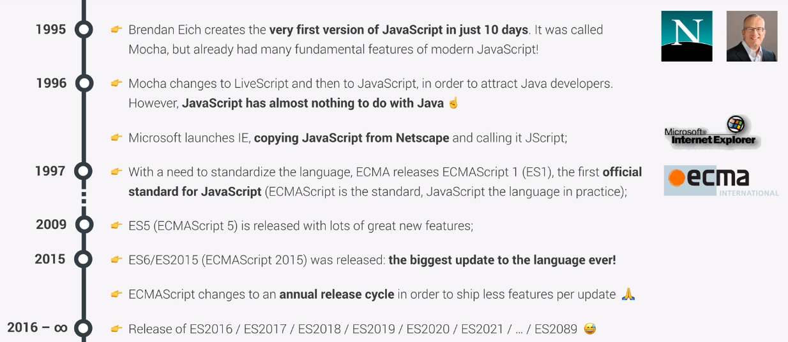
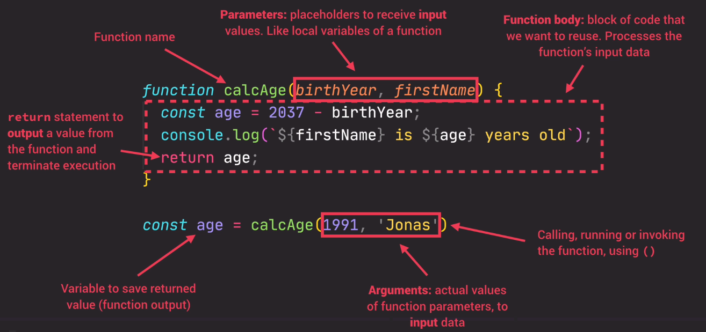

# Javascript Manual

---

Javascript is an high-level, object-oriented, multi-paradigm programming language. In web development, while htm and css are responsible for the content and the styling of the webpage, js is responsible for handling its dynamic and user interaction, to load data, e.g. from databases, to manipulate html and css content and so on. Frameworks like React, Angular and Vue.js are tools that enhance the creation of webpages and are 100% based on js. In the same way we can use js also outside the browser, on webserver, to build back-end services with framework like node.js.

## JS release
Starting from 2015, with the release of ES6 (ECMAScript) we talk about modern javascript, and since then an annual release has been done with some new features.



An important dogma of the js release is **`DON'T BREAK THE WEB!`** which traduces is a full backward compatibility of modern js engine withe older version up to ES1 (1997).

However Js is not forward compatible, i.e. older version of the browser may not be able to understand what will come next in modern or future js. For these reason is good practice to develope with the aid of the latest release of google chrome and, in production try to translate (`transpile and polyfill`) the same code in ES5 (fully supported from 2011) with tools like `Babel` to ensure compatibility with all browsers.

To have an understand of what is compatible in ES6 we can check https://kangax.github.io/compat-table/es6/

## Run JS code
JS code needs always to be related to an html file. We can directly code inside the html file under the `<script>` tag. We can watch what we have executed using the webpage inspector under the `console` tag only if we have redirected the output to the console itself using the command `console.log(my_var)`. However, what is done in practice is to create a separate `script.js` file that will contain the js instruction and will be loaded inside the html file. The connection between html and js is usually done at the bottom of the body part as:

```js
<script src="script.js"><script>
```

## Styling rules
* commands must be ended with semicolon `;`
* variables are written in camelCase style
* variables cannot start with numbers, and can contains only number, letters, dollar sign and underscore
* variables cannot use reserved keyword like *new* or *function*
* variables shouldn't start with upper case letter (uppercase are related to class)
* constant are written in uppercase
* use descriptive variable even if a bit longer

### Comments
Simple comments are done with the `//` while multi-line comments are done with `/* ... */`. In vs code multi-line comment are performed with `Ctrl + Shift + A`.

## Strict mode

For security reasons of our code we should always place, as the absolute first line of our code, the following line:

`'use strict'`;

This line activates the `strict mode` that forbid us to do certain errors and create visible errors where usually we may encounter a silent failure. Moreover, it reserves some words to core js construct/functions so that can't be used as variables name, avoiding possible conflicts.

---

# Values and Variable
Values are basically the smallest unit of information that we have in js; these can be stored in variable with the assignation symbol `=`. To declare a variable we simply:

```js
let firstName = "Giovanni";
```

*firstname* is now a variable that stores a string and can be later be manipulated or printed to console. `let` has to be used only the first time we declare a variable, if we want to reassign a value to an existing variable we don't need it. 

N.B. we can declare more than one variable at the time and also leave it without assignment (e.g. `let x, y;`)

## Variable declaration
We have seen that to declare a variable the first time we use the keyword `let`, while to mutate its content we can simply call the variable name. There are other methods from ES6 to declare variables that are more expressive: 

* `const` is used to declare variable that cannot mutate; for this reason, it is not possible to declare empty const variable.

* `var` is the prior ES6 declaration, `not to be used anymore!`

As a best practice, it is better to always use `const` to declare a variable unless we are really sure it should be changed along the script. We want to have the minimum amount of mutable variable in the code since these can be source of bug.

We can potentially use a variable without using any of these constructors and it will work just fine, but it is a terrible idea since it want have a reference in the local scope of the script!

---

# Datatype
Like python, js is a dynamically typed programming language, meaning that the type of data passed to a variable is not declared but directly inferred by js and, in general, can be changed at any time. It is the value that as ah inherent type, not the variable.

There are several type of datatype in js. but first of all lets distinguish between `object` and `primitive`.

`Primitive` are:
* numbers, by default floats
* string
* boolean
* Undefined, a variable that has been declared but not assigned
* Null, another empty value (n.b. for legacy reasons, *typeof null* will return *object*)
* Symbol, a value that is unique and cannot be changed
* BigInt (from ES2020), a larger integer, too large for the number type

## Checking types
We can inspect the type of a value or a variable by using the operator `typeof` 

```js
console.log(typeof true);
// output: boolean
```

## Type conversion and coercion
`Conversion` is the voluntary action of change one variable from a datatype to another, while `Coercion` is an undeclared change in datatype carried out by js in particular situations. An example of `Coercion` is when printing a concatenation of string and numbers; the concatenation will automatically convert the number in string behind the scene. The opposite happen when concatenating with the `-` numbers in string format; in this case js will convert strings into numbers.

```js
// type coercion
console.log('10' + 3) // return 103
console.log('10' - 3) // return 7
```

Example of `Conversion` are those functions like:
* `Number(arg)` -> return NaN if arg cannot be converted
* `String(arg)`
* `Boolean(arg)` -> evaluate the truth values of a variable

## Truthiness of a value
The truth value of a variable is the boolean representation of that value `Boolean(arg)`. By default all the values evaluate tu `true` except for:

* `0`
* `''` -> empty string
* `undefined` -> e.g. asking for a key that doesn't exist in an object (dictionary)
* `null`
* `NaN`

---

# Basic Operator
Basic operations are performed in a similar manner in every high level programming language at least similar to python for what I know). For a complete list of `operator precedence` see https://developer.mozilla.org/en-US/docs/Web/JavaScript/Reference/Operators/Operator_Precedence; most operation are carried out left-to-right but some others, like assignment or exponential are applied right to left, meaning that the lest part of the expression is first evaluated and the assigned to the right part (same in python)·

## Mathematical
* `+` is summation and string concatenation
* `-` is subtraction
* `*` is multiplication
* `/` is division
* `%` is mod operator 
* `**` is power elevation

## Assignment
Operator that assign or reassign values to variables

* `=` assign a variable to a value e.g. `x = 10`
* `+= or -= or *= or /=` in line operation on the variable
* `++ or --` increase/decrease the variable by 1

## Comparison
Comparison operator works as expected, producing a boolean value in output.

* `>, <, >=, <=` are the comparison operator

## Logical
Logical operators relative to boolean mathematics are:
* AND -> `&&`
* OR -> `||`
* not var -> `!`var

N.B. the 'not' operator `!` has precedence on `&&` and `||`

## Equality operator
We have two type of equality operators: `===` that check a strict equality, meaning that no coercion is carried out, and `==` , the loose equality operator that evaluate to true even if a coercive conversion has to be carried out by js:

```js
18 === 18 // true
'18' === 18 // false
'18' == 18 // true
```

The loose equality operator can introduce strange behavior in our code, therefore only use it if it strictly necessary.

Similarly we have the inequality, strict and loose, which are defined as `!==` and `!=`.

---

# Strings 
Strings are very important primitives types. They can be concatenated with the `+` sign, and js will automatically convert the type to a string if possible, or in a cleaner way (from ES6) with `strings template` (basically python f-string).

```js
const name = 'Giovanni';
const stringTemplate = `My name is ${name}!`; // `` back ticks required
```

In the same way, the back ticks format of writing strings is very useful to write multi-line strings simply returning each new line.

```js
const multiLineString = `This is a
                        multi-line
                        string`
```

---

# if, else control structure
The `if / else` code block si defined as `control structure` and is composed by:

```
if (condition) {
        executed if true;
    } else {
        executed if false;
    }
```

Everything that is defined inside the control structure exist only there, therefore, we cannot use a variable that is defined/created inside the if/else block outside of the block itself. We have first to define the variable outside the structure to be able to access it again after it has been modified by the if/else.

```js
const name = 'Giovanni';
const age = 19;

if (age >= 18) {
    console.log(`${name} can drive a car!`);
} else {
    const yearsLeft = 18 - age;
    console.log(`${name} isn't old enough to drive!
He will be in ${yearsLeft} years`);
}
```

When the if statement is only one line (it test only the *true* scenario) we can omit the `{}`:

```js
const age = 18
if (age === 18) console.log('You are now an adult!');
```

## else if
We can concatenate more than one if condition with the `else if` constructor (`elif` in python):

```js
let dummy = 1;
if (dummy === 1) {
    console.log("exactly 1!")
} else if (dummy > 1) {
    console.log("greater than 1!")
} else {
    console.log("less then 1!")
}
```

## The Switch statement
An alternative to multiple *if - else if* block is to use a `switch statement`. Coming from python, it is essentially a dictionary which contains a series of key-action pairs. The comparison between the keys and the test value is a strict comparison `===`.
The `break` keyword is needed after each key in order to stop the execution, otherwise js will execute everything up to the first `break`. Two cases that follows up without a break have the same logic of an `OR` statement.

```js
const pickANum = prompt("Please choose a number");

switch (pickANum) {
  case "1":
    console.log("you picked 1");
    break;
  case "2":
  case "3":
    console.log("You picked a number between 2 and 3");
    break;
  default:
    console.log(`You picked ${pickANum}`);
}
```

## The Conditional operator
Another way to use the if-else statement in more compress way is the `Conditional operator` also called `Ternary operator` since it is composed by 3 parts: first we have a statement, followed by a question mark `?`, followed by the `true` condition, followed by semicolon `:` and at last by the `false condition`.

```js
const age 20;
age >= 18 ? console.log('You are an adult'): console.log('You are a child')
```

In a more realistic scenario we use it to conditionally store a variable:

```js
const age = 20;
const whoAreYou = age >= 18 ? 'Adult' : 'Child'
// instead of
let whoAreYou;
if (age >= 18) {
  whoAreYou = "Adult";
} else {
  whoAreYou = "Child";
}
```

In this way we are storing a value in the variable status based on a ternary operator.

Ternary operator are useful also in string templates since we can insert any expression inside the `${}`.

---

# Loops

Together with if/else, loops are the fundamentals control structure of every programming language. 

## For loop
In js, the for loop is structure in the following way:

```js
for(let i = 1; i <=10; i++) {console.log(`Repetition number ${i}`)};
```

So, we have 3 parameters: the first one is the declaration of the lopping variable `let i =1`, the second is the stopping criteria, i.e. stops when `i = 10`, and this gets evaluated at each loop until it return `false`, the third is the incremental step, in this case we are adding 1 to `i` at each iteration. 

A common operation is to loop on arrays to retrieve or create elements:

```js
const square = [];
const integers = [0, 1, 2, 3];
for (let i = 0; i < integers.length; i++) {
  console.log(integers[i]);
  square[i] = i ** 2;
}
```

### Continue and break
We can elaborate even more the structure of the for loop be inserting `continue` and `brake` conditions; essentially we are going to test with an if/else statement the truthiness of an expression and if we add **continue** to it, if evaluated **true** it will skip the current iteration, while if we add **break** it will exit entirely from the loop:

```js
const square = [];
const integers = [0, 1, 2, 3, 4];
for (let i = 0; i < integers.length; i++) {
  console.log(i % 2);
  if (i % 2 != 0) continue;
  square.push(i ** 2);
}

console.log(integers, square);
```

### Looping backwards
In the same way we can loop backward on an array by simply switching the conditions, i.e the starting point of `i` will be the length of the array and the step values will be `-1` (i--):

```js
const integers = [0, 1, 2, 3];
for (let i = integers.length; i >= 0; i--) {console.log(integers[i])};
```

### Nested loops
Ofc, for loops can also be nested at multiple levels simply be nesting the same structure inside the loop body:

```js
for (let i = 0; i <= 3; i++) {
  for (let j = 0; j <= 3; j++) {
    console.log(i, j);
  }
}
```

## While loop
In the while loop we have only to specify the stopping condition, the declaration of the incrementing variable has to be outside the loop while its step towards the stopping condition has to happen inside the loop itself:

```js
let i = 0;
while (i<10) {
  console.log(i);
  i++;
}
```
 The strength of a while loop is that it doesn't need a counter but only a condition to evaluate the decision of stopping or continuing running.


---

# Functions



## Function declaration

The constructor for functions ins js is the following:

```js
function function_name(what) {
  const whatIsIt = `This is the function ${what}`;
  return whatIsIt;
}

const whatIsIt = function_name("body");
// now we can use the variable 'sayIt' anywhere in the code
console.log(whatIsIt);
```

So, we have the keyword `function`, the name of the function with possible arguments passed inside the parenthesis, and the `function-body` inside the curly brackets.

To call the function we simply need to write the function name: `function_name();`, but if we want to use in the code the variable that is `return` inside the function, we need to store the function call into another variable. We call this way of defining a function `function declaration`.

## Anonymous functions (function expression)

Another way to declare a function is to directly assign it to a variable without giving it a name; in this way, when we want to call the function later on, we will directly call the variable in which we store it.

```js
const anonymous = function (arg) {return console.log(arg)};
anonymous();
```

This way of defining a function is called `function expression`

**N.B. The main practical difference between function declaration and function expression is that the former can be called in the code also before its definition.**

### Arrow functions

From ES6 there is a new, more compressed way to write function expression, that is arrow function (similar compression happen in the [conditional operator](#The-Conditional-operator) to replace the if/else statement).

```js
const arrow = (arg) => console.log(arg);
arrow("ciao");

const big_arrow = (arg1, arg2) => {
  const arg3 = arg1 + arg2;
  return arg3;
};
big_arrow(2, 4);
```

Essentially we don't need the curly braces (becaomes mandatory if we need to perform more than one operation inside the function), the keyword *function* and **the return is implicit** (if we have only one line of function, if the curly braces are needed, i.e. there is more than one line of coe, than the return has to be explicit). 


## Built-in functions

### prompt()
The js function to ask for user input is called `prompt`; it returns a string that can be stored in a variable. 

```js
const pickANum = prompt("Please choose a number");
```


### Number()
Convert a compatible type to number


---

# Arrays

*coming from python array == list*

Arrays is the most basic **ordered** data structure that js has to hold **data of any type**. It can be created in different ways:

```js
const array = [1, 2, 3, 4];
const array = new Array(1, 2, 3, 4);
```

Elements of arrays have `zero-based` indices and can be retrieved with the squared brackets and possibly reassigned:

```js
array[0] // first element of the array
array[1] = 5 // second element replaced with 5
```

Arrays are `objects` and as such they can have properties; in particular arrays have the property `length` that returns the number of element and it is called with the dot notation `array.length`.

Array are not `primitive types`, therefore, even if created as constant (`const`), their whole structure can be replaced by, let's say another array, but their elements can mutate.

## Array's basic methods

Arrays have a myriad of methods, i.e. functions, that can be applied to them to do operations. Following a list of the most basic and common ones:

* `array.push(arg)`: add an element **to the end** of the array; it also *return* the new length of the array
* `array.unshift(arg)`: add element **to the beginning** of the array; it also *return* the new length of the array
* `array.pop()`: remove the **last element** of the array; it also *return* the element popped
* `array.shift()`: remove the **first element** of the array; it also *return* the element popped
* `array.indexOf(arg)`: return the index of *arg* in the array; if the element is not in the array it  *return* `-1`
* `array.include(arg)`: check with strict equality (===, i.e no type coercion) if arg is in array; return is boolean


---

# Objects

*coming from python objects == dictionary*

An object is a collection of **unordered** key-value pairs:

```js
const person = {firstName: 'Giovanni', lastName: 'Frison'};
person.firstName; // Giovanni
person['lastName']; // Frison
```

The difference in retrieving the value with the dot or the brackets notation is that inside the brackets we are able to write an expression that compose to a key value, and this can come handy in certain situations.

```js
// a silly example
const key = 'Name';
person['last' + key]
```

We can use both the dot and the bracket notations to also add an entry to our object:

```js
person.birthYear = 1989;
person['isMarried'] = true;
```

We can insert also key-value pairs that holds functions and in this case they goes under the name of `methods` of the object:

```js
person.calcAge = (birthYear, presentYear) => presentYear - birthYear;  
```

When working on a function that is held by an object we may need to refer another property of the object itself. In the example above, the variable `birthYear` is already a property of the object `person` therefore it doesn't make sense to repeat it, both for the possibility of introducing error and the redundancy (not compliant with the `DRY` don't repeat yourself - principle). To avoid this we can refer to a property of the object holding the function `age` with the special keyword `this` (**N.B. it doesn't work with arrow function.. not sure but probably because of they are stored in memory**):

```js
person.calcAge = function (presentYear) {return presentYear - this.birthYear};
```
*We can think at `this` as the `self` used in python classes.*

This works, but we can think at a smarter way to do it, becaus right now we are computing the subtraction every time we call the function, but in reality, what is return by the function is clearly a new property of the object `person`. Therefore, a smarter way to proceed would be to store the *return* directly as a new property:

```js
person.calcAge = function (presentYear) {
  const this.age = presentYear - this.birthYear;
  return this.age // we could avoid the return at all};
```
Now, when the calcAge will be called the first time ti will append to the object `person` the property `age` avoiding us and the machine the burden to compte it over an over when requested.

