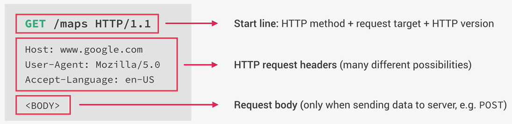

# Node Js Manual (v16 LTS)

*https://nodejs.org/dist/latest-v16.x/docs/api/*

---

## What is Node Js?

*https://nodejs.org/en/about/*

At a high level, `Node is a JS runtime that is built on google's open source V8 JS engine`. While standard JS engine is
meant to communicate inside a browser (and any browser is able to understand JS), **Node is the way we run JS code
outside the browser**. Therefore, since we don't have the browser to parse and run the code, we need a new "container",
and this is the **V8 Js engine**. Running outside the browser gives JS the potential to access the filesystem and
improved networks capability making it a perfect solution to be used as `web servers` in order to create the **backend**
of fast (single-thread based on event driven I/O model) and scalable applications. The features of Node make it ideal
for solution like:

* databases API (preferably NoSQL)
* data streaming
* real-time chat
* serve-side dynamic web application

It is also god to know that `Node is NOT suited for heavy server-side application` (CPU intensive) due to is
single-thread design; it just not meant to be used for that!

## The Node terminal

Once Node is installed, we can simply open a terminal and type `node` and it will open a node session where we can
directly write and execute JS code.

To run an external script we can simply:

* `node [file_name].js`

### Tips

* `Ctrl + D`: close the session
* double Tab: shows the environment variables or the method bounded to a particular object (also autocompletion)

---

# Intro to back-end development

*https://www.cloudflare.com/it-it/learning/dns/what-is-dns/* -> what is the DNS
*https://www.ionos.it/digitalguide/server/know-how/presentazione-dei-protocolli-tcpip/* -> what is the TCP/IP

Each time we query the browser for a webpage or an API we are making a **request** to the server that is hosting the
service, and we receive back a **response**; this is defined as the **client-server architecture**. A web address is
commonly composed by a **protocol** (http or https), a **domain name** (e.g. www.google.com) and a **resource** (e.g.
/maps). The domain name is not the real address at which the website is hosted but a nice human-readable replacement,
therefore we need a service called **DNS** to translate it for our browser. The first step is a **DNS lookup**,
something similar to a search in a phone book aimed to find a match in the DNS between the alias and the real ip address
that hosts the webpage.
Once the ip address is resolved, a **TCP/IP socket connection** is established between the client and the server and
kept alive for the entire duration of the communication. Once the connection is established the client can perform
an `HTTP request` (Hyper Text Transfer Protocol) (N.B. TCP/IP and HTTP are only communication protocols, i.e. a set of
rules that need to be established to create a common ground for data transfer in the through the internet).



The image above shows an example of a http request, something that we don't write ourselves but still we should be able
to read and understand. In the start line we have the `http method` (e.g. GET, POST) that depend on the action we want
to perform (e.g. get or send data to the server).


---

# NPM - Node package manager

*https://www.npmjs.com/*

The npm is the pip of js, it contains all the natively available modules that can be imported to expand the
functionality of our code. It is the larger registry online!

At the beginning of a new project we should type:

* `npm init`

This will generate a `package.json` file (similar to the requirement.txt with pip freeze), listing the specification of
the project and all the external module installed in order to be able to recreate the same environment anywhere we
deploy our code.

## Installing dependency

We have two types of dependency:

* **simple/regular dependency**: is code, imported in our code, upon which we built our code! (e.g. express)
    * `npm install slugify`: once we perform the installation, the dependency will be added to our package.json file
* **developer dependency**: like a debugger, something that we don't use directly in our code. To install a dependency
  as dev we need to add at the end of the install command `--save-dev`
    * `npm install nodemon --save-dev`

To install all the dependency of our project, i.e. the ones listed in our **package.json**, we cna simply enter the
project folder and type:

* `npm install`

### Global install

There are some packages that are so commonly used that aren't worth to be installed only locally in our project
environment; instead it is more useful to install them in the `global` environment adding the flag `--location=global`
to the installation command.

### Using local install

To use locally project-depended modules (e.g. we want to start a specif version of nodemon installed locally for our
app) we can't directly call them from terminal since by default it access the global installations. Instead, we can add
in the `package.json` under the field `script` special pairs of keyword:command (called nom scripts) to be executed with
the local packages:

```json
"scripts": {
"test": "myTest.js",
"start": "nodemon index.js"
}
```

Then we can execute our app simply typing in our terminal

```sh
npm start
```

### Package versioning

*in general true for every programming language*

package version is composed by 3 set of numbers *x.y.z*, eg. 1.10.25; the rhs number is used for bug fixes, the central
one for feature update that won't brake backward compatibility and the first number is for major new release that might
break backward compatibility

With the command `npm outdated` we retrieve a list of modules that have a potential update to be installed

To install a specific version of a package, simply write its name followed by @x.y.z:

* `npm install nodemon@1.0.0`

In the **package.json**, local installation of modules is usually written as *"package-name" : "^x.y.z"*; the `^` means
that we accept **minor update** (update on **y** and **z**) of the same package to be used in the project. If instead we
replace `^` with `~` it means that we only accept **bug fixes** (update on the **z**). To accept new version, even major
update, use `*` instead

## Uninstall a package

To uninstall a package simply type:

* `npm uninstall [package_name]`

---

# Modules

Like any programming language, Node has a countless number of third party libraries (modules) specialized to perform
specific task.

To import a module inside a script we simply assign it to a constant with the `require()` method:

* `const fs = require('fs')`; where fs is the **file system** module to work with files and directories.

## `fs`: filesystem manager

*const fs = require('fs')*

**fs** is the filesystem manager module for js; everything from read/write files/folders etc..

## `http`: building a web server

**http** is the module used to create a web server

*const http = require('http')*

The main constructor is given by:

```js
const server = http.createServer((req, res) => {
});
```

where `req` and `res` are the request made to the server and the response given back. Both the method have many
arguments to handle the user interactions

## `url`: create Routing

**url** modules is used to parse url query in a format that can be handled by js

*const url = require('url')*

We can use it to parse the queries in the url and properly redirect the routing:

```js
url.parse(req.url, true)
```

This will return an object that under the field `query` will contain a dictionary with listed the query information (
e.g. if **req.url** is **mypage?id=0**, the dictionary will contain **{id:'0'}**)

## `nodemon`: automatic restart server

**nodemon** is a useful dev utility that check for modification in our project folder and automatically restart our
server to appreciate the changes without the need of relaunch and refresh. To use it simply lunch the application with

```sh
nodemon app.js
```

Basically it is a wrapper around the node command

---

# Synchronous Vs Asynchronous

Synchronous programming means that each line of the script is executed in order, and its execution **blocks** the single
Node thread, i.e. nothing else can happen. For the way Node was designed and for its applications, synchronous
programming is not acceptable, since we may need to execute different task at the same time without freezing our
program. In an Asynchronous task, the work is performed in the background by so called `callbacks functions`, so that in
the meantime other actions can happen, and the results is retrieved only when effectively needed.

Thinking of Node as a backend service for web applications, the need of asynchronicity is crystal clear: imagine that
our web app is accessed by 10 user at the same time, if the backed was written synchronously, each user would need to
wait for the one requesting an action. unacceptable. We want our users to be able to asynchronously operates our app
without any interruption. Therefore, the structure of a Node code is strongly based on callbacks functions to generate
a `Non-blocking I/O model`. N.B. callbacks function are not natively asynchronous, only specific functions from the Node
API are specifically design to run asynchronously (e.g. the filesystem function `fs.readFileSync` has is async
counterpart `fs.readFile`).

---

# Routing

Routing is the process of handling different url requests to a web-server. The most basic way to perform it is to use
the `url` module and check the requested url, redirecting the user to the appropriate page or eventually handling
errors (like 404 Page not found)